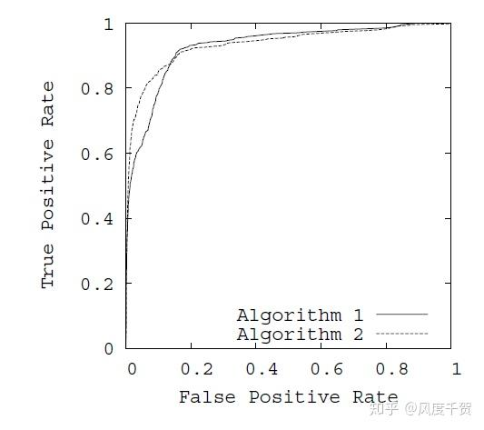
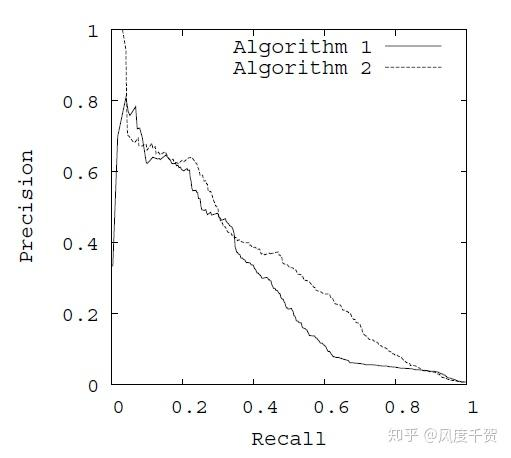

# 数学和手撕

## 常见导函数

| 表达式                    | 导数                                          |
| ------------------------- | --------------------------------------------- |
| $f(x) = x^n$              | $f'(x) = n x^{n-1}$                           |
| $f(x) = e^x$              | $f'(x) = e^x$                                 |
| $f(x) = a^x$              | $f'(x) = a^x \ln a$                           |
| $f(x) = \ln x$            | $f'(x) = \dfrac{1}{x}$                        |
| $f(x) = \log_a x$         | $f'(x) = \dfrac{1}{x \ln a}$                  |
| $f(x) = \sin x$           | $f'(x) = \cos x$                              |
| $f(x) = \cos x$           | $f'(x) = -\sin x$                             |
| $f(x) = \tan x$           | $f'(x) = \sec^2 x$                            |
| $f(x) = \arcsin x$        | $f'(x) = \dfrac{1}{\sqrt{1-x^2}}$             |
| $f(x) = \arccos x$        | $f'(x) = -\dfrac{1}{\sqrt{1-x^2}}$            |
| $f(x) = \arctan x$        | $f'(x) = \dfrac{1}{1+x^2}$                    |
| $f(x)=g(h(x))$            | $f'(x)=g'(h(x))\cdot h'(x)$                   |
| $f(x)=u(x)v(x)$           | $f'(x)=u'(x)v(x)+u(x)v'(x)$                   |
| $f(x)=\dfrac{u(x)}{v(x)}$ | $f'(x)=\dfrac{u'(x)v(x)-u(x)v'(x)}{[v(x)]^2}$ |

## 似然和概率的区别

**概率：** 是指在一个已知模型（含已知固定参数）的前提下，预测可能出现某个数据或事件的可能性。

**似然：** 是指已观测到数据后，用于描述在不同参数假设下产生该数据的“可能性”。

## 手撕 Self-attn 

```python
import torch
import torch.nn as nn

class SelfAttention(nn.Module):
    def __init__(self, embed_dim):
        """
        embed_dim: 输入特征的维度（通常也是输出特征的维度）
        """
        super(SelfAttention, self).__init__()
        self.embed_dim = embed_dim

        # 定义用于生成 query、key 和 value 的线性映射
        self.W_q = nn.Linear(embed_dim, embed_dim)
        self.W_k = nn.Linear(embed_dim, embed_dim)
        self.W_v = nn.Linear(embed_dim, embed_dim)

        # 缩放因子，通常取开方(embed_dim)用于稳定梯度
        self.scale = embed_dim ** 0.5

    def forward(self, x):
        """
        x: 张量，形状为 (batch_size, seq_length, embed_dim)
        """
        # 生成 query, key 和 value
        Q = self.W_q(x)  # (batch_size, seq_length, embed_dim)
        K = self.W_k(x)  # (batch_size, seq_length, embed_dim)
        V = self.W_v(x)  # (batch_size, seq_length, embed_dim)

        # 计算注意力分数，使用缩放点积
        # Q 与 K 的转置相乘，得到 (batch_size, seq_length, seq_length) 的分数矩阵
        attention_scores = torch.matmul(Q, K.transpose(-2, -1)) / self.scale

        # 对注意力分数做 softmax 归一化
        attention_weights = torch.softmax(attention_scores, dim=-1)

        # 注意力加权求和得到最终输出
        out = torch.matmul(attention_weights, V)  # 前面的 Batch 维度会自动对齐
        return out, attention_weights

```

## 手撕MHA

```python
import torch
import torch.nn as nn
import math
class MultiHeadAttention(nn.Module):
    def __init__(self, embed_dim, num_heads):
        """
        Args:
            embed_dim: 输入的embedding维度（也是输出维度）
            num_heads: 注意力头的数量
        """
        super(MultiHeadAttention, self).__init__()
        self.embed_dim = embed_dim
        self.num_heads = num_heads
        # 保证 embed_dim 可以被 num_heads 整除
        assert embed_dim % num_heads == 0, "Embedding dimension must be divisible by number of heads"
        self.head_dim = embed_dim // num_heads
        # 定义三个线性层，用于映射到 query, key, value 向量
        self.q_linear = nn.Linear(embed_dim, embed_dim)
        self.k_linear = nn.Linear(embed_dim, embed_dim)
        self.v_linear = nn.Linear(embed_dim, embed_dim)
        # 输出映射层，将多个头拼接后的结果转换到最终空间
        self.out_linear = nn.Linear(embed_dim, embed_dim)
    
    def forward(self, query, key, value, mask=None):
        """
        Args:
            query, key, value: 形状均为 (batch_size, seq_len, embed_dim)
            mask: 可选参数，形状为 (batch_size, 1, 1, seq_len) 或 (batch_size, 1, seq_len, seq_len)
                  用于在计算注意力得分时将部分区域置为无效
            
        返回：
            output: 注意力模块输出，形状 (batch_size, seq_len, embed_dim)
            attn: 注意力权重，形状 (batch_size, num_heads, seq_len, seq_len)
        """
        batch_size = query.size(0)
        # 1. 线性映射，将输入映射到 query, key, value 空间
        Q = self.q_linear(query)  # (batch_size, seq_len, embed_dim)
        K = self.k_linear(key)
        V = self.v_linear(value)
        # 2. 分头：将 embed_dim 分成 num_heads 个 head，每个 head 的维度为 head_dim
        # 新的形状：(batch_size, num_heads, seq_len, head_dim)
        Q = Q.view(batch_size, -1, self.num_heads, self.head_dim).transpose(1, 2)
        K = K.view(batch_size, -1, self.num_heads, self.head_dim).transpose(1, 2)
        V = V.view(batch_size, -1, self.num_heads, self.head_dim).transpose(1, 2)
        
        # 3. 计算 scaled dot-product attention
        # Q 与 K^T 的结果形状：(batch_size, num_heads, seq_len, seq_len)
        scores = torch.matmul(Q, K.transpose(-2, -1)) / math.sqrt(self.head_dim)
        if mask is not None:
            scores = scores.masked_fill(mask == 0, float("-inf"))
        attn = torch.softmax(scores, dim=-1)
        
        # 将注意力权重与 V 相乘，得到加权后的上下文向量
        context = torch.matmul(attn, V)  # (batch_size, num_heads, seq_len, head_dim)
        
        # 4. 拼接所有 head 的输出
        # 先将维度转回 (batch_size, seq_len, num_heads, head_dim)，再合并 num_heads 与 head_dim
        context = context.transpose(1, 2).contiguous().view(batch_size, -1, self.embed_dim)
        
        # 5. 输出层
        output = self.out_linear(context)
        return output, attn

```

## 什么是困惑度

**定义与直观解释**
衡量语言模型对测试数据的“惊讶程度”。直观上，可以把困惑度看作模型对下一个词做出预测时的不确定性。困惑度越低，说明模型对数据的预测越“确定”，性能越好；反之，困惑度高则表明模型对数据的预测不稳定，表现较差。

**数学表达**
语言模型产生的token序列 $w_1, w_2, \dots, w_N$，模型为该序列分配的概率为 $P(w_1, w_2, \dots, w_N)$。困惑度定义为：
$$
\text{Perplexity} = \exp\left(-\frac{1}{N} \sum_{i=1}^{N} \log P(w_i \mid w_1,\dots,w_{i-1})\right)
$$


这个公式中，$-\frac{1}{N} \sum_{i=1}^{N} \log P(w_i \mid w_1,\dots,w_{i-1})$ 是平均交叉熵，故**困惑度其实是交叉熵的平均值的指数版本**。

**困惑度越小越好, 最小值为1.**

> 1. **交叉熵（Cross-Entropy）**
>    对于一个真实分布 $ q(x) $ 和模型预测的分布 $ p(x) $，交叉熵定义为：
>    $$
>      H(q, p) = -\sum_x q(x) \log p(x)
>    $$
>      在语言模型中，常常假设真实分布 \( q(x) \) 是“one-hot”分布（即目标词的概率为 1，其它词为 0），那么对于一个正确的词 $ x $ 得到的负对数似然就是：
>    $$
>      -\log p(x)
>    $$
>
>    对整个数据集取平均，就得到了每个 token 的平均交叉熵损失。
>
> 2. **困惑度（Perplexity）**
>    $$
>    \text{PPL} = \exp\left(\frac{1}{N}\sum_{i=1}^{N} -\log p(x_i)\right)
>    $$
>    其中 \( N \) 是token的数量。这个公式告诉我们：先计算所有 token 的负对数概率的平均值（也就是平均交叉熵），然后取自然指数得到困惑度。

## F1, P, R

1. 查准率（Precision）公式：

$$
\text{Precision} = \frac{TP}{TP + FP}
$$

2. 召回率（Recall）公式：

$$
\text{Recall} = \frac{TP}{TP + FN}
$$

3. F1 Score 公式（查准率和召回率的调和平均）：

$$
F1 = 2 \cdot \frac{\text{Precision} \times \text{Recall}}{\text{Precision} + \text{Recall}}
$$

## ROC和PR曲线的细节

* 对于 ROC 曲线，x 轴代表 FPR，y 轴代表 TPR，通过不同阈值的取值描绘模型在正负样本区分上的能力。(越靠近左上角越好)



- 对于 PR 曲线，x 轴代表 Recall，y 轴代表 Precision，更侧重于评价正样本的检测情况。(越靠近右上角越好)

  

#### ROC 曲线

- **定义：**  
  ROC 曲线展示了不同判定阈值下模型的「真正率」（True Positive Rate, TPR）与「假正率」（False Positive Rate, FPR）的权衡情况。  

- **计算方式：**  
  对于每个选择的阈值：
  - 真正率（TPR，也叫召回率）：  
    TPR = TP / (TP + FN)
  - 假正率（FPR）：  
    FPR = FP / (FP + TN)  
    其中 TP（True Positives）为真正例数，FN（False Negatives）为漏报数，FP（False Positives）为误报数，TN（True Negatives）为真负例数。

- **评价指标：**  
  ROC 曲线下面积（Area Under Curve，AUC-ROC）是一个常用的综合评价指标，值越接近 1 表示模型性能越好。

- **优缺点及适用场景：**  
  - 优点：  
    - 不受类别分布不平衡问题的影响较大，因为 FPR 考虑了 TN 数量，在类别平衡或轻微不平衡的场景下效果较好。  
    - 能直观地展示模型对不同误差类型的权衡。  
  - 缺点：  
    - 当负样本数量远大于正样本时（极度不平衡数据），FPR 可能非常低，即使有大量误报也难以反映在 ROC 上。

---

#### PR 曲线

- **定义：**  
  PR 曲线展示了不同阈值下模型的「查准率」（Precision）与「召回率」（Recall，即 TPR）的关系，更关注正样本的检测质量。

  > 在二分类任务中，模型通常会输出一个表示为正例的概率或分数，而判定一个样本属于正例还是负例需要将这个概率与一个事先设定的门槛值比较。这个门槛值就称为判定阈值。

- **计算方式：**  
  对于每个选择的阈值：

  - 查准率（Precision）：  
    Precision = TP / (TP + FP)
  - 召回率（Recall）：  
    Recall = TP / (TP + FN)

- **评价指标：**  
  常用平均精度均值（Average Precision, AP）来总结 PR 曲线的表现。AP 会综合考虑不同召回率下的查准率。

- **优缺点及适用场景：**  

  - 优点：  
    - 在正负样本分布严重不平衡的场景下表现更为敏感，因为它直接反映了误报（FP）的影响。  
    - 对于主要关注正样本检测（如罕见事件检测）的任务，PR 曲线能提供更有意义的评价。  
  - 缺点：  
    - 在类别比较平衡的情况下，PR 曲线与 ROC 曲线可能提供的信息重合较大。

***

#### 阈值选择与曲线绘制

- **阈值变化：**  
  无论是 ROC 还是 PR 曲线，都通过调整模型的决策阈值（比如将连续的预测概率转换为二分类标签的方法）来计算 TP、FP、FN、TN，从而绘制曲线。随着阈值从较高降到较低，通常：
  - TPR 与 Recall 会增加（更多正样本被预测为正）。
  - FPR 会增加，Precision 可能下降（更多负样本被误判为正）。

- **曲线形状的解释：**  
  - 对 ROC 曲线而言，理想的曲线应该越靠近左上角（低 FPR，高 TPR），而随机猜测的模型大致在对角线上。  
  - 对 PR 曲线而言，理想的曲线应尽可能高（高 Precision）且延伸到右侧（高 Recall）；随机模型的 Precision 等于正样本的比例。

***

**与类别不平衡的关系**

- 当正负样本数量非常不平衡时：
  - ROC 曲线可能显示出较高的 AUC，因为 FPR 的分母 TN 数量巨大，即使存在大量 FP，FPR 数值依然较低。  
  - PR 曲线则会更直观地反映低 Precision，因为 FP 对 Precision 的影响很大。在这种场景下，PR 曲线往往比 ROC 曲线更能揭示模型在正样本预测上的实际效能。

***

ROC 和 PR 曲线各有侧重：  

- ROC 曲线强调模型对正负样本区分的全面能力，适合类别较平衡的情况。  
- PR 曲线则更加关注正样本，特别适用于不平衡数据场景。  

在模型评估时，建议结合两者进行综合分析，同时根据实际的业务需求和样本分布情况选择合适的评估指标。

以上就是 ROC 和 PR 曲线的主要细节介绍。


# 条件概率

# 余弦相似度

对于两个向量 $\mathbf{A}$ 和 $\mathbf{B}$，余弦相似度计算如下：

$$\cos(\mathbf{A}, \mathbf{B}) = \frac{\mathbf{A} \cdot \mathbf{B}}{|\mathbf{A}||\mathbf{B}|} = \frac{\sum_{i=1}^{n} A_i B_i}{\sqrt{\sum_{i=1}^{n} A_i^2} \sqrt{\sum_{i=1}^{n} B_i^2}}$$

### 

```python
def cosine_similarity_manual(x, y, eps=1e-8):
    # 计算点积
    dot_product = torch.sum(x * y, dim=-1)
    # 计算各自的范数
    norm_x = torch.sqrt(torch.sum(x ** 2, dim=-1))
    norm_y = torch.sqrt(torch.sum(y ** 2, dim=-1))
    # 加入 eps 防止除零错误
    cosine_sim = dot_product / (norm_x * norm_y + eps)
    return cosine_sim

cos_sim_manual = cosine_similarity_manual(vec1, vec2)
print("Cosine Similarity (Manual):", cos_sim_manual.item())
```

# Triplet Loss


三元组损失要求对于一个锚点样本 \(a\)，存在一个正样本 \(p\)（与锚点属于同一类别）和一个负样本 \(n\)（与锚点类别不同）。目标是确保锚点与正样本之间的距离小于锚点与负样本之间的距离，并且二者之间至少有一个预先设定的“margin”。

**数学表达式：**
$$
\mathcal{L} = \max\left\{ d(a, p) - d(a, n) + \text{margin},\ 0 \right\}
$$
其中：

- \(d(\cdot, \cdot)\) 表示距离度量，比如欧氏距离或余弦距离。
- \(\text{margin}\) 是一个正的超参数，用于保证两类样本之间的距离差异足够大。

**直观理解：**
三元组损失的基本思想是：如果负样本离锚点太近，则会受到惩罚；只有当正样本与锚点足够接近、而负样本远离锚点时，才不会产生额外的损失。margin是要求再正样本和锚点再近一点, 负样本和锚点再远一点.

# InfoNCE Loss

数学上，考虑一组 $2N$ 个样本，其中每个样本都有一个正样本对．设经过编码器得到的特征表示为 $\{z_k\}_{k=1}^{2N}$，且假设对于 $i \in \{1, \dots, N\}$，正样本对为 $(z_i, z_{i+N})$；对于 $i \in \{N+1, \dots, 2N\}$，正样本对为 $(z_i, z_{i-N})$。如果定义相似度函数（例如余弦相似度）$sim(z_i, z_j)$，则 InfoNCE Loss 通常写作(注意**分母不包含负样本**)

$$
\ell(i) = -\log \frac{\exp\Big(sim(z_i, z_{j(i)})/\tau\Big)}{\sum_{k=1}^{2N,\; k\neq i}\exp\Big(sim(z_i, z_k)/\tau\Big)}
$$


其中 $\tau$ 是温度超参数，$j(i)$ 表示 $z_i$ 的正样本对的索引；整个 mini-batch 的损失为

$$
L = \frac{1}{2N} \sum_{i=1}^{2N} \ell(i)
$$


这个损失鼓励正样本对之间的相似度尽可能高，而其他负样本对的相似度尽可能低。

---

下面是一段使用 PyTorch 实现 InfoNCE Loss 的代码，并给出了一个简单的 case 来演示如何使用该函数。

```python
import torch
import torch.nn.functional as F

def info_nce_loss(features, temperature=0.1):
    """
    计算 InfoNCE Loss。
    
    参数：
      features: tensor, shape [2N, feature_dim] 表示一个 mini-batch 的所有特征表示，
                每个样本有两个视图（例如，同一图像的两个不同数据增强）。
      temperature: 温度超参数，用于缩放相似度

    返回：
      loss: InfoNCE Loss (标量)
    
    假设：对于样本 i (0 <= i < N)，其正样本对为 (z_i, z_{i+N});
          对于样本 i (N <= i < 2N)，其正样本对为 (z_i, z_{i-N})。
    """
    # 假设 mini-batch 中总共有 2N 个样本，其中 N 表示原数据样本数（每个样本经过两种数据增强）
    # features 的 shape 为 [2N, feature_dim]
    batch_size = features.shape[0] // 2  # 得到 N

    # 对特征进行 L2 标准化，沿着 feature 维度归一化，shape 不变 [2N, feature_dim]
    features = F.normalize(features, dim=1)

    # 计算 cosine 相似度矩阵, 即每两个特征间的点积.
    # matmul 后得到的 sim_matrix shape 为 [2N, 2N]
    sim_matrix = torch.matmul(features, features.T)

    # 缩放相似度 logits = sim_matrix / temperature, shape 依然为 [2N, 2N]
    logits = sim_matrix / temperature

    # 置对角线为一个非常小的值 (-9e15)，防止与自身匹配
    logits.fill_diagonal_(-9e15)

    # 构造正样本对的目标索引标签：
    # 对于 0 <= i < N，正样本索引为 i+batch_size（第二个视图）;
    # 对于 N <= i < 2N，正样本索引为 i-batch_size（第一个视图）;
    # labels 的 shape 为 [2N]
    pos_labels_first_half = torch.arange(batch_size, 2 * batch_size, device=features.device)   # 对于 0 <= i < N, 目标索引为 i+batch_size
    pos_labels_second_half = torch.arange(0, batch_size, device=features.device)                # 对于 N <= i < 2N, 目标索引为 i-batch_size
    labels = torch.cat([pos_labels_first_half, pos_labels_second_half], dim=0)


    # 把每一行 logits 当作对所有候选样本的预测，用交叉熵损失迫使正样本对应的对数概率最大。
    loss = F.cross_entropy(logits, labels)
    return loss

# -------------------- 示例代码开始 --------------------

# 假设特征向量的维度为 128，原始批次的样本数 N 设为 4，因此总共有 8 个样本（2N = 8）
feature_dim = 128
N = 4

# 构造一个随机 tensor，shape 为 [2N, feature_dim]，即 [8, 128]
features = torch.randn(2 * N, feature_dim)
print("初始 features 的 shape:", features.shape)   # 输出: [8, 128]

# 调用 info_nce_loss 函数计算损失
loss = info_nce_loss(features, temperature=0.1)
print("InfoNCE Loss:", loss.item())

# -------------------- 示例代码结束 --------------------

```


