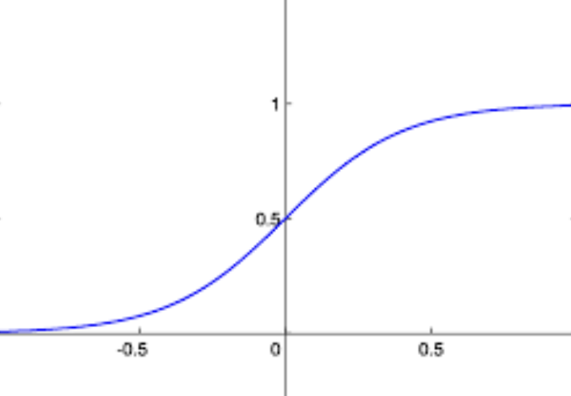
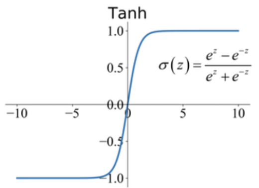
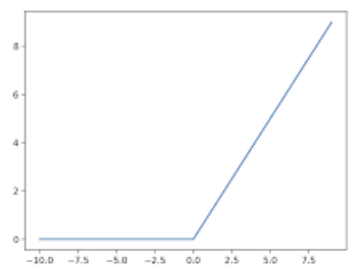

```
BN在训练阶段和推理阶段有何不同

如果让你用llm做一个商品类目识别的项目，你会如何设计

数组和链表有何不同
插入和删除任务在两个数据结构上时间空间的复杂度是怎样的
快排的思想，时间复杂度

如何评估prompt好坏？如何优化prompt？
解释一下Textual Inversion

Kmeans等聚类算法 (done)
python底层通信机制 (skipped)
SKLEARN 怎么用 (skipped)
BPE

混合精度的原理是什么 (done)

神经网络能否用全0或全1初始化

微调技术了解多少，讲了LoRA、ptuningv1、ptuningv2、qLoRA
Alibi

相比于SFT为什么需要RLHF
RAG Agent中的检索如何做，检索和LLM冲突

cross-entropy 最大似然的角度
有没有其他方式判断过拟合
L1 和 L2 正则化的区别？它们都能防止过拟合吗？
解释dropout的作用，训练和测试阶段是否有区别(*)，如何解决dropout预估偏高的问题？

模型的方差 偏差分别是什么呢
训练的过程中怎么判断方差 偏差的大小呢？
如何优化方差或偏差呢？

激活函数sigmoid、tanh出现梯度可以怎么处理
9. 怎么理解auc，手撕auc计算

Adam公式

SVM损失函数是什么？hinge loss
树类的算法了解
Xgboost 了解吗
Svm损失函数是什么
如何求解SVM
有什么包  sklearn
如何进行特征选择
如何评价特征重要性
对比学习的损失怎么设计
Triplet loss是什么
```

```
编辑距离
第k大元素
K链表升序排列
中缀表达式
```


# 基础知识


## 线性回归

```python
import numpy as np

# 生成一些模拟数据
np.random.seed(42)
X = np.random.rand(100, 1)  # 特征
y = 3 * X + 4 + np.random.randn(100, 1) * 0.1  # 标签，y = 3x + 4，加上一些噪声

# 初始化参数
w = np.random.randn(1)
b = np.random.randn(1)

# 设置超参数
learning_rate = 0.001
n_iterations = 1000

# 存储 loss 的变化
loss_history = []

# 训练过程
for i in range(n_iterations):
    # 前向传播
    y_pred = X @ w + b

    # 计算损失（均方误差）
    loss = np.mean((y_pred - y) ** 2)
    loss_history.append(loss)

    # 反向传播（计算梯度）
    grad_w = 2 * np.mean((y_pred - y) * X)
    grad_b = 2 * np.mean(y_pred - y)

    # 参数更新（梯度下降）
    w -= learning_rate * grad_w
    b -= learning_rate * grad_b

    # 每100次迭代打印一次损失
    if i % 100 == 0:
        print(f"Iteration {i}: Loss = {loss}")

# 输出训练后的参数
print(f"Trained weight: {w}")
print(f"Trained bias: {b}")

# 绘图展示 loss 收敛情况
import matplotlib.pyplot as plt
plt.plot(loss_history)
plt.xlabel('Iteration')
plt.ylabel('Loss')
plt.title('Loss Convergence')
plt.show()
```


## 逻辑回归


首先，我们假设有输入特征向量
$$
\mathbf{x} = [x_1, x_2, \ldots, x_n]
$$

和权重向量
$$
\mathbf{w} = [w_1, w_2, \ldots, w_n],
$$
以及偏置项 \( b \)。

线性部分的表达式为：
$$
z = \mathbf{w}^T \mathbf{x} + b
$$
为了把上面的线性组合映射到 (0,1) 的概率值，我们使用 Sigmoid 函数，其定义为：
$$
\sigma(z) = \frac{1}{1+e^{-z}}
$$
逻辑回归预测的概率为：
$$
P(y=1|\mathbf{x}) = \sigma(z)
$$


对于分类问题，通常我们设定一个阈值作为决策边界（例如 0.5）：
- 如果 \(\sigma(z) \geq 0.5\)，则预测 \(y=1\);
- 如果 \(\sigma(z) < 0.5\)，则预测 \(y=0\).


逻辑回归采用最大似然估计对参数进行训练。假设训练数据为 $\{(\mathbf{x}_i, y_i)\}_{i=1}^{m}$ ，其中 $y_i \in \{0,1\}$，则似然函数是每个样本预测概率的乘积。为了简化，可以使用负对数似然，也称为交叉熵损失函数：

$$
L(\mathbf{w}, b) = -\frac{1}{m} \sum_{i=1}^{m} \Bigl[ y_i \log (\hat{y}_i) + (1-y_i)\log (1-\hat{y}_i) \Bigr]
$$


其中 $\hat{y}_i = \sigma(\mathbf{w}^T \mathbf{x}_i + b)$。

为了最小化损失函数 $L(\mathbf{w}, b)$，通常使用梯度下降或其变种（如随机梯度下降、Mini-batch 梯度下降、Adam 等）进行参数更新。更新规则如下（以梯度下降为例）：

$$
w_j := w_j - \alpha \frac{\partial L}{\partial w_j},\quad b := b - \alpha \frac{\partial L}{\partial b}
$$


## 为什么点积注意力除根号d (Paypal)

* 为什么要除一个数?
  - 因为后面会用到softmax, softmax是两边饱和的.
  - 如果输入的数值太大, 就会落入softmax的饱和区, 梯度会趋近于0
* 为什么选根号d
  * 因为Query和Key均为独立且**均值为0, 方差为1**的向量
  * 当计算Q和K的点积的时候, $Q \cdot K = \sum_{i=1}^{d} Q_i K_i$ (可以暂时假设dim==1), 因为存在d次加法, 所以方差为$d \times 1 = d$
  * 而$D(\frac{QK}{\sqrt{d}}) = \frac{d}{\sqrt{d}^2} = 1$, 可以将方差规范化为 1, 使训练稳定.

## 为什么不基于字符分词 (Paypal)

如果按字母分词，一个普通句子可能会变成几百个token. 序列越长，计算复杂度就越高(attention是O(n²)的)

## 梯度爆炸/消失原因及解决办法

梯度消失的原因:

1. 链式法则累乘效应. 如果每一层的梯度均小于 1，那么经过很多层后梯度会逐渐衰减到接近 0
2. 常用的 sigmoid 或 tanh 激活函数在输入值较大或较小时，其导数会饱和
3. 网络太深

解决办法:

1. 选择其他例如ReLU的激活函数
2. 使用残差连接
3. 使用Normalization稳定激活分布

***

梯度爆炸原因:

1. 链式法则累乘效应. 
2. 权重初始化过大

解决办法:

1. 进行梯度裁剪: 计算梯度的L2范数, 然后判断是否太大, 然后缩放.

2. 使用L2正则化

3. 选择合适的权重初始化方式. 

   > He初始化:
   >
   > 对于使用ReLU激活函数的层, 权重从均值为0的正态分布中采样, 标准差设置为与当前神经元的输入个数有关
   >
   > $\sigma = \sqrt{\frac{2}{n_{\text{in}}}}$

## ViT处理流程 (Paypal)

原始图像 → 尺寸调整 → 划分图像块 → 展平成向量 → 线性映射 → 添加位置编码 → 添加CLS Token → 构建输入序列 → 标准化 → 批量处理 → 模型输入

1. 图像尺寸调整 (Resize)
   将输入图像调整为固定大小，通常是正方形（例如，224x224像素）。这是为了统一所有输入图像的尺寸，使得后续的处理更加简单。
   尺寸调整通常通过插值方法（如双线性插值）进行，保持图像的宽高比不变。
2. 划分图像块 (Patch Partitioning)
   将调整后的图像划分为固定大小的非重叠块（Patches），例如16x16像素或32x32像素。
   每个图像块可以被视为一个小的局部图像区域，这些块将作为ViT的输入。
3. 展平图像块 (Flattening Patches)
   将每个图像块展平成一维向量。如果图像块的大小是16x16像素，并且输入图像是RGB图像（即每个像素有3个通道），则每个块会被展平为一个长度为16x16x3=768的向量。
4. 线性映射 (Linear Projection)
   对每个展平后的图像块进行线性映射，将其投影到更高维度的空间中。这个步骤通常通过一个线性层实现，输出的维度与Transformer的隐藏层维度相匹配（如768或1024）。
   线性映射后，每个图像块被转换为具有固定长度的嵌入向量（Patch Embedding）。
5. 添加位置编码 (Add Positional Encoding)
   因为Transformer模型不具备CNN那样的空间信息感知能力，需要加入位置编码（Positional Encoding）来帮助模型理解图像块在原始图像中的位置。
   位置编码可以是固定的或可训练的，通常是与图像块的嵌入向量相加。
6. 生成分类标识符 (CLS Token)
   在输入序列的最前面添加一个特殊的分类标识符（CLS Token）。这个Token在Transformer处理完所有图像块后，将用于图像分类任务的最终输出。
   CLS Token也是一个向量，与图像块的嵌入向量具有相同的维度。
7. 构建输入序列 (Input Sequence)
   最终的输入序列包括CLS Token和所有图像块的嵌入向量，以及对应的位置信息。整个序列将作为ViT的输入，进入Transformer层进行进一步处理。
8. 标准化 (Normalization)
   在一些实现中，图像在被划分为图像块之前，会进行标准化处理，例如将像素值归一化到[0, 1]或[-1, 1]范围，或者减去均值再除以标准差。
9. 批量处理 (Batching)
   在实际应用中，通常会将多个图像组成一个批次（Batch）进行处理，以便于并行计算。批处理有助于加速训练过程。
10. 模型输入
    经过上述处理后，图像被转换为适合Transformer模型输入的格式，模型开始处理这些输入以进行图像分类或其他任务。

## 如何计算显存占用 (WXG)

模型训练时，显存占用主要分为以下几个部分：

1. 模型参数

   就是模型的参数量乘以每一个数的字节数即可，比如float32就是4B，7B即70亿参数量，空间大小就是7x$10^9$x4Byte = 28GB。

   > 1GB = $10^9$ Byte

2. 梯度

   模型每个参数对应一个梯度，显存占用和权重占用是一样的。以上面为例，梯度占用空间就是28GB。

3. 优化器状态参数

   需要根据优化器的状态参数来计算。

   1. 如果是Adam/AdamW，每个权重参数都需要保存**动量**(一阶矩)和**方差****(二阶矩)，那么就是权重占用的两倍。
   2. 如果是带动量的SGD，那就需要**动量**，占用就是和权重一样。
   3. 如果是无动量的SGD，那就不需要额外的参数，因为SGD只需要梯度就可以了。

4. 激活值

   激活值大小主要取决于**batch size**和**层数**，具体可以表达为：
   $$
    B \times L \times Length \times S \times d 
   $$


   其中B是批大小，L是层数，Length是序列长度，S是精度单位，d是特征维度。

5. 缓存

   一般程序会保留一部分额外显存作为缓存，来协助CUDA的使用，一般需要1GB左右。

## Deepspeed 几个阶段介绍 (WXG)

ZeRO Stage 1：优化器状态分割

Stage 1 的思路是将这些优化器状态（如动量、二阶矩估计值等）在各个 GPU 之间做分割、分步存储，即每个 GPU 只保存整体中一部分的状态

ZeRO Stage 2：梯度分割

Stage 2 不仅分割优化器状态，还对在反向传播过程中产生的梯度进行分割。即梯度不再在每个设备上完全复制，而是在设备间分布存储。

ZeRO Stage 3：参数分割（连同状态与梯度）

Stage 3 是最为激进的优化策略，它将模型参数本身也进行切分，每个 GPU 只存储整个模型参数的一部分。在这种模式下，整个模型的参数被所有设备共同管理，而不是完整复制。

## DP和DDP的区别

1. 使用场景不同

   - DP支持**单机多卡**和**多线程**，是一个**单进程**的框架。
   - DDP则支持**多机多卡**，同时也是**多进程**的。

2. 模型复制策略不同

   - 对于DP，**处理每一个batch的时候，0号卡都需要把当前最新的模型复制给各个GPU。**

     DP在主节点做reduce梯度求平均后，用这个梯度更新主节点的模型参数，然后在下一轮batch的时候，把主节点更新好的模型broadcast到每一个节点（模型复制）

   - 对于DDP，**则是在开始的时候，0号卡将模型复制给各个GPU，这个复制只会发生一次。**

     因为DDP在对local梯度做all reduce后(相当于单节点reduce+brodcast），每个节点用当前的全局平均梯度更新模型参数，所以在下一个batch时，所有节点都是更新好的模型。

3. 数据加载方式不同

   - 对于DP，0号卡读取**batch数据**, 然后再切分成小的batch传给各个GPU。
   - 对于DDP，会使用**DistributedSampler**, 将数据集划分成多个子集, 然后将**数据子集**传给各个GPU。

4. 通信次数不同

   - 对于DP，处理每个batch时需要多次通信，包括传输数据、模型复制、传送各个卡的模型输出、传送loss和梯度，几乎每一步都需要0号卡和其他卡之间的通信。
   - 对于DDP，处理每个batch时只需要0号卡和其他卡通信一次，也就是最后一步**给各个卡上的local梯度求平均**。

## 如何缓解过拟合, 有什么办法 (WXG)

1. **增加训练数据量**：更多的训练样本有助于模型学习真实的数据分布

2. **数据增强**：通过旋转、缩放、裁剪、噪声添加等方式人工扩充训练集

3. **正则化技术**：

   - L1正则化（Lasso）：促使部分权重变为零，实现特征选择

   - L2正则化（Ridge）：限制权重大小，防止单个特征影响过大

   - 弹性网络（Elastic Net）：结合L1和L2正则化的优点

4. **早停（Early Stopping）**：监控验证集性能，在性能开始下降时停止训练

5. **Dropout**：训练过程中随机丢弃一部分神经元
6. **批量归一化（Batch Normalization）**：稳定深层网络训练，具有轻微正则化效果
7. **学习率衰减**：逐渐减小学习率，避免在最优解附近震荡

8. **模型集成**：
   - Bagging（如随机森林）：训练多个模型并平均预测结果
   - Boosting（如XGBoost, AdaBoost）：顺序训练模型，每个模型关注前一个模型的错误
   - Stacking：组合多个基础模型的预测

9. **噪声注入**：向输入或权重添加随机噪声，增强鲁棒性
10. **权重约束**：限制神经网络权重的最大范数
11. **层归一化/实例归一化**：特别适用于RNN和风格迁移等任务
12. **Label Smoothing**：软化标签，在正确类别上分配一个略小于 1 的概率，而在其他类别上分配一个非零的小概率。
13. **混合训练（Mixup）**：创建样本和标签的凸组合用于训练: $ c=\lambda a+(1-\lambda) b$
14. **对抗训练**：使用对抗样本增强模型鲁棒性
15. **知识蒸馏**：用简单模型学习复杂模型的输出层logit, 或中间层logit. 当学生模型在学习教师模型的输出时，其本质上是在捕捉数据的全局信息，而不是简单地记住训练集中的每个样本细节。

## weight decay (WXG)

**weight decay** 通过调节模型复杂度对损失函数的影响, 防止模型过拟合。

其基本思想是: 就是给损失函数增加一个L2正则项
$$
L_{\text{total}}(\theta) = L(\theta) + \frac{\lambda}{2} \|\theta\|_2^2
$$
其中，$\|\theta\|_2^2$表示所有模型权重的L2范数的平方，λ控制正则化的力度。

***

在实际训练中，并不一定需要对模型中所有参数都施加 weight decay, 因为加 weight decay 会迫使这些参数向 0 靠拢

不需要进行weight decay的:

* **偏置项**. 没有必要.
* **Normalization**中的缩放与位移参数. 可能破坏归一化层恢复数据分布的能力.
* **嵌入层参数(**负责将词mapping到连续向量空间). 这通常会掩盖或削弱词语之间原有的语义关系

## 如何缓解样本不均衡的情况 (WXG)

1. **重采样技术**

   - **上采样**：增加少数类样本，如随机复制少数类样本
   - **下采样**：减少多数类样本，如随机移除部分多数类样本
   - **SMOTE**：合成少数类样本技术，通过在少数类样本之间插值生成新样本

2. **数据增强**

3. **加权损失函数**

   - 为不同类别样本分配不同权重，如根据样本数量的反比设置权重. 例如：加权交叉熵损失（Weighted Cross-Entropy）
     $$
     L_{\text{Weighted CE}} = -\sum_{c=1}^{C} w_c \, y_c \log (p_c)
     $$

4. **特殊损失函数**

   - **Focal Loss**：自动降低易分类样本的权重，关注难分类样本
     $$
     L_{FL} = -\sum_{c=1}^{C} \alpha_c\,(1-p_c)^{\gamma}\, y_c\, \log(p_c),
     $$
     Focal loss 是在标准交叉熵损失的基础上引入一个调制因子, 该调制因子在正确预测概率较高时会降低损失，让难分类的样本来主导Loss优化方向。

     

## 各种激活函数

- **Sigmoid**

  最基础的激活函数，函数值范围(0, 1)，公式如下：
  $$
   \sigma(x) = \frac{1}{1 + e^{-x}} \\ \sigma{\prime}(x) = \sigma(x) (1 - \sigma(x))
  $$


  缺点很简单，如果进入饱和区，那么梯度将会变小（梯度消失问题），其次是输出不对称。

  

- **Tanh**

  Sigmoid改良，范围(-1, 1)：
  $$
   \text{Tanh}(x) = \frac{e^x - e^{-x}}{e^x + e^{-x}} \\ \frac{d}{dx}\text{Tanh}(x) = 1 - \text{Tanh}^2(x)
  $$


  优点是输出是对称的，缺点是还是可能饱和。

  > **非对称激活函数（如 Sigmoid 函数，输出范围为 0 到 1）：**由于输出的非对称性，激活函数的平均值偏向于正值，导致梯度更新也有可能偏向某一特定方向。换句话说，如果输出范围总是正值，反向传播过程中会产生偏差，进而影响参数的更新，使得网络的学习效率下降。 **对称激活函数（如 Tanh 函数，输出范围为 -1 到 1）：**输出的对称性意味着激活函数的输出值可以同时分布在正负两侧，梯度更新也会更加平衡。由于输出的均值更接近 0，梯度更新的正负方向均能被有效考虑，这有助于加速收敛并提升训练效果。

  

- **ReLU**

  $$ ReLU(x) = \max(0, x) $$

  导数很简单就不说了，主要的优点有四点：单侧抑制、相对宽阔的兴奋边界、及其容易计算的导数和稀疏激活性。缺点主要是0点的导数不可导以及“Dying ReLU”问题。

  

## 几个优化器的异同 (WXG)

* 没有动量：梯度下降<计算所有样本的梯度平均> / SGD<随机选择一个样本计算梯度> / 小批量随机梯度下降<每次处理一批样本>
* 一阶动量（惯性）：SGDM<梯度更新方向由历史梯度更新方向和当前梯度更新方向共同决定> 
* 二阶动量（自适应学习率）：AdaGrad<迄今为止所有梯度的平方和> / RMSProp<只关注过去一段时间内的梯度更新频率> 
* 一阶动量+二阶动量：Adam<SGDM+AdaDelta> / AdamW<Adam+L2正则化>

> 一阶矩就是动量, 主要影响方向
>
> 二阶矩是梯度的平方, 可以理解为是梯度的能量, 放在分母项, 从而避免因梯度过大导致参数更新过快，或者震荡不稳


**SGD（随机梯度下降）**

```math
\theta_{t+1} = \theta_t - \eta \nabla_{\theta} L(\theta_t)
```

- **特点**：简单直接，但容易陷入局部最优，并且在鞍点或陡峭/平缓区域表现不够稳定。

***

**SGD with Momentum （带动量的SGD）**

```math
v_{t} = \gamma v_{t-1} + \eta \nabla_{\theta} L(\theta_t)
```

```math
\theta_{t+1} = \theta_t - v_{t}
```

其中：  

- $v_t$为当前动量，即梯度的累计  
- $\gamma$ 是动量因子（通常取值在0.9左右）

- **特点**：能在陡峭方向上加速收敛，同时在震荡区域可提供缓冲，克服SGD单纯使用梯度方向带来的问题。

***

**AdaGrad**

```math
G_{t,i} = \sum_{\tau=1}^{t} g_{\tau,i}^2
```

```math
\theta_{t+1,i} = \theta_{t,i} - \frac{\eta}{\sqrt{G_{t,i} + \epsilon}} g_{t,i}
```

其中：  

- $g_{t,i}$ 为第 \(t\) 次迭代时第\(i\)个参数的梯度  
- $G_{t,i}$ 为历史梯度平方和  
- $\epsilon$为防止除零的小常数

- **特点**：对每个参数单独调节学习率，但累积的梯度平方容易逐步增大，导致后期学习率过小，更新过早停滞。

***

**RMSProp**

- **基本思想**：对AdaGrad进行改进，不直接累加所有历史梯度的平方，而是使用指数衰减的累积，这样可以在训练后期保持较合理的学习率。

- **更新公式**：

  ```math
  E[g^2]_t = \beta E[g^2]_{t-1} + (1-\beta) g_t^2
  ```

  ```math
  \theta_{t+1} = \theta_t - \frac{\eta}{\sqrt{E[g^2]_t + \epsilon}} g_t
  ```

  其中：  

  - $E[g^2]_t$为梯度平方的指数加权平均  
  - $\beta$通常设置为0.9

- **特点**：能在学习过程中保持动态调整的学习率，不会像AdaGrad那样单调递减，适合大部分非凸问题。

***

**Adam**

- **基本思想**：结合了Momentum和RMSProp的思想，即同时维护梯度的一阶矩（均值）和二阶矩（未中心化的方差）的估计，从而实现对学习率的自适应调整。

  > * “一阶矩”在统计学中通常指均值（期望值）。在这里，它就是梯度的平均值，表示梯度的主要方向或趋势。
  > * “二阶矩”通常指的是随机变量平方的期望，未做中心化（即没有减去均值后再平方），因此它衡量的是梯度的幅度或能量，也可以看作是梯度“方差”（但注意这里是未中心化的方差）。

- **更新公式**：

  首先计算历史信息, 一阶和二阶矩的指数加权平均：

  ```math
  m_t = \beta_1 m_{t-1} + (1-\beta_1) g_t
  ```

  ```math
  v_t = \beta_2 v_{t-1} + (1-\beta_2) g_t^2
  ```

  然后进行偏差校正：

  > 在 Adam 算法中，我们会对过去的梯度进行一种“加权平均”，也就是计较之前的梯度对当前更新的贡献。因为一开始我们把这些历史梯度的值都设成了 0，所以前几次“平均”的时候，值会被零稀释掉，导致结果比实际的梯度值小（也就是“偏低”）。
  >
  > 偏差校正就是为了“补偿”最初因为历史信息不足而导致的低估问题

  ```math
  \hat{m}_t = \frac{m_t}{1-\beta_1^t}
  ```

  ```math
  \hat{v}_t = \frac{v_t}{1-\beta_2^t}
  ```

  最后参数更新：

  ```math
  \theta_{t+1} = \theta_t - \frac{\eta}{\sqrt{\hat{v}_t} + \epsilon} \hat{m}_t
  ```

- **特点**：结合了Momentum平滑和RMSProp的自适应学习率调整，能在大部分任务中表现出色，被广泛使用；缺点是相对于简单SGD计算复杂度更高，对超参数（如$\beta_1, \beta_2$）较为敏感。

***

**AdamW**

* L2正则和Weight Decay**在Adam**这种自适应学习率算法中**并不等价**，只有在标准SGD的情况下，可以将L2正则和Weight Decay看做一样.

* 在Adam中, 如果引入L2正则项，在计算梯度的时候会加上正则项求梯度的结果。正常的权重衰减是对所有的权重都采用相同的系数进行更新，本身比较大的一些权重对应的梯度也会比较大，惩罚也越大。

在AdamW中，权重衰减作为一个单独的步骤应用，不受自适应学习率调整的影响
$$
w_{t+1} = w_t - \alpha \left( \frac{\hat{m}_t}{\sqrt{\hat{v}_t} + \epsilon} + \lambda w_t \right).
$$


## 聚类算法 (Paypal)

**Kmeans**

1. 确定cluster的数量K, 然后随机选择K个初始质心 (Kmeans++的优化就是按顺序选质心, 每次都选远一点的)
2. 对每个数据点，计算它与所有质心之间的距离（一般使用欧几里得距离），并将该数据点分配给距离最近的质心所在的cluster
3. 对每个cluster跟新质心位置
4. 重复直到收敛

选出来的cluster是球形的

**DBSCAN**

超参数:

- ε (epsilon)： 定义邻域半径。
- minPts (min points)：定义在ε半径内形成簇的最小点数。

做法:

1. 对每个店计算其epsilon领域内的点数, 如果大于等于minPts, 则标记为核心点
2. 将核心点和其epsilon领域内的点视作为一个cluster
3. 找到领域中每个核心点, 将其密度可达的点也纳入同一个cluster (传播扩展出去)

通过核心点和边界点的关系实现簇的扩散，很适合解决非球形簇问题和噪声点过滤。

## 混合精度的原理

前向和反向传播的时候, 大部分操作可以再FP16下完成, 进而提高运算速度.

而权重更新和梯度累积(如果有使用), 对数值精度要求较高, 需要使用FP32

***

 Loss Scaling提出的动机 : 因为使用了FP16进行计算, 容易导致梯度数值下溢, 使梯度变为0

 Loss Scaling的步骤:

1. 在正向传播过程中，将计算得到的损失乘以一个较大的常数因子
2. 利用放大后的损失进行反向传播，此时梯度也相应地被放大。
3. 在进行参数更新之前，将梯度除以相同的 scaling factor

`torch.cuda.amp`中的`GradScaler`做的就是这个事情

***

* FP32: 1 位符号 + 8 位指数 + 23 位尾数
* FP16: 1 位符号 + 5 位指数 + 10 位尾数
* BF16: 1 位符号 + 8 位指数 + 7 位尾数 (指数位和FP32一样)

只需要记住FP32和BF16都是8位指数位

