# 多模态大模型相关

## 介绍一下Flash Attention (京东)

Flash Attention通过将注意力计算分块并利用GPU内存层次结构，避免存储完整的注意力矩阵，从而将注意力机制的内存复杂度从O(N²)降低到O(N)，同时保持数学等价性。

作用: 加速计算,节省显存.

>  传统Attention: 序列长度为N时，需要存储 N×N 的注意力矩阵
>  Flash Attention: 通过分块计算，不需要存储完整的注意力矩阵


## 介绍一下VLLM

如果不用VLLM, 则在大模型推理的时候就会比较慢. 

这是因为大模型在自回归生成的时候现在基本都要存储KV Cache. 导致占用很多GPU显存. 限制了同时处理的请求数量, 降低吞吐量.

> LLM在推理一个request的第一个token的时候, 剩下的显存就已经被预分配一大部分了, 导致没办法响应其他请求

VLLM的PagedAttention 通过引入类似于 虚拟内存管理的思想, 将 KV缓存进行**物理分块**管理. 即使模型在逻辑上需要连续的输入序列，实际的物理内存块可以是非连续的. 这样子可以提高显存利用率, 同时也可以将不同逻辑块map到同一个物理块, 减少重复缓存.

作用: 节省显存, 提高吞吐量.


## RoPE

$$
f(q, m)=R_m q=\left(\begin{array}{cc}
\cos m \theta & -\sin m \theta \\
\sin m \theta & \cos m \theta
\end{array}\right)\binom{q_0}{q_1}
$$

RoPE位置编码通过将k和q左乘一个旋转矩阵，为其赋予位置信息.  然后Q，K再进行接下来的注意力分数矩阵的计算，总的来说LLaMA对于Rope的实现是通过复数乘法运算.

其中m为位置下标, $\theta$与维度k和位置m有关:
$$
\theta_k=\frac{m}{10000^{\frac{2 k}{d}}}
$$
d是词嵌入向量的总维度

然后存在以下性质, 以实现相对位置编码:
$$
\left(\boldsymbol{\mathcal { R }}_m \boldsymbol{q}\right)^{\top}\left(\boldsymbol{\mathcal { R }}_n \boldsymbol{k}\right)=\boldsymbol{q}^{\top} \boldsymbol{\mathcal { R }}_m^{\top} \boldsymbol{\mathcal { R }}_n \boldsymbol{k}=\boldsymbol{q}^{\top} \boldsymbol{\mathcal { R }}_{n-m} \boldsymbol{k}
$$

***

RoPE具有远程衰减性

***

在 RoPE 设计中，低维度的部分会有较高的旋转频率，而高维度的部分旋转频率则较低。频率的高低决定了嵌入向量如何与序列位置（token 位置）进行编码。具体来说：

- **低维度编码：高频信息**

低维度部分会有较大的旋转角度，因此这些维度在嵌入中会捕捉到与位置变化相关的高频率信息。这意味着这些维度在较短的序列之间会更敏感，能够更好地捕捉到位置较为接近的 token 之间的差异，也就是**短距离依赖**（近邻 token）。

- **高维度编码：低频信息**

高维度部分由于旋转角度非常小，它的频率更低，这意味着高维度部分的嵌入会更适合编码**长距离依赖**（远程 token）。也就是说，这些维度对 token 的位置变化不敏感，但更擅长表示长距离 token 之间的相对位置信息。

## ALiBi

ALiBi不向单词embedding中添加位置embedding，而是**根据token之间的距离给 attention score 加上一个预设好的偏置矩阵**，比如 q 和 k 相对位置差 1 就加上一个 -1 的偏置，两个 token 距离越远这个负数就越大，代表他们的相互贡献越低。

ALiBi 位置编码是不需要通过训练的，给定的预设矩阵中还会乘上m的调节因子，m的设置与attention的头数有关，是2的指数差值。

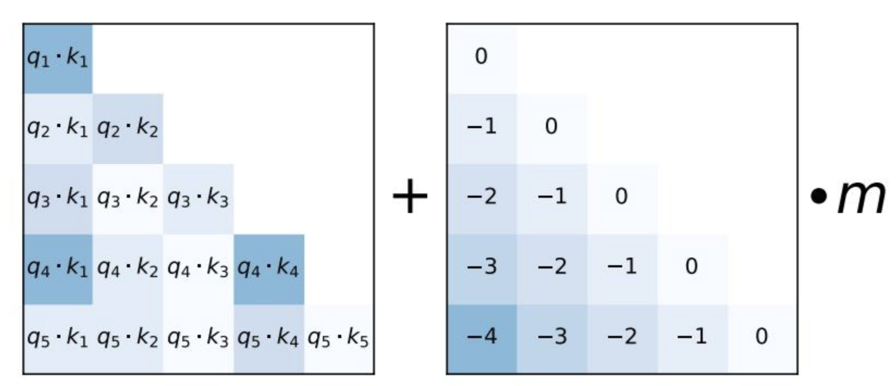


## Temperature/Top-P/Top-K

https://zhuanlan.zhihu.com/p/666670367

只用记住温度越大越随机，温度越小越稳定就可以了。

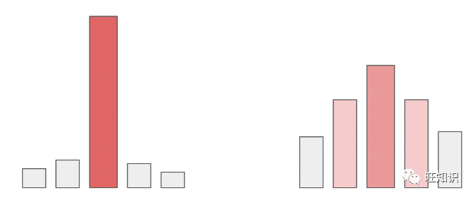

具体的数学形式，就是对每一个在Softmax前prob项除以一个温度T：
$$
\begin{array}{c}
p\left(x_{i}\right)=\frac{e^{\frac{x_{i}}{T}}}{\sum_{j=1}^{V} e^{\frac{x_{j}}{T}}} \\
=\frac{1}{\sum_{j=1}^{V} e^{\frac{x_{j}-x_{i}}{T}}}
\end{array}
$$

***

正常解码策略不会只是贪心选择最大概率的token

而是:

原始logits -> Temperature调整 -> Top-k过滤 -> Top-p过滤 -> 重新softmax -> 按当前概率加权随机采样


top-k和top-p用于控制选择token的范围

* top-k: 对 logits 排序，保留概率最高的k个 token
* top-p: 从概率最高的词开始往下加，直到这些词的累积概率总和超过一个阈值 P, 保留当前的token.


ref: 

* https://zhuanlan.zhihu.com/p/1928600606718813384
* https://community.openai.com/t/temperature-top-p-and-top-k-for-chatbot-responses/295542/2


## Prefill 和 Decode

Prefill: 并行处理prompt的token, 生成KV Cache, 计算密集型, 

Decode: 串行处理token, 对访问KV Cache有IO需求, 

> 在prefill阶段，大模型一次性对prompt中所有token进行计算QKV，由于不同token的计算是独立的，因此该过程可以并行。在attention部分，由计算得到的QKV进一步计算出Output矩阵，再经过后续的FFN层和解码得到首字母token。
>
> 在decode阶段，计算原理和prefill完全相同，但计算方式和decode是不能一样的。原因有两个。
>
> * 一是随着seqlen增加，Attention计算复杂度平方级增长，直接计算代价很大，导致长序列的推理时间极慢，甚至不可行。
> * 二是对decode阶段的计算过程简单分析发现，该过程可以复用prefill阶段的KV结果，也可以复用docode阶段已经产生的KV结果。综上，可以把已产生的KV存起来，不必重新计算，这就是KV cache。对于Q矩阵，每次需要计算的只是Q的最后一行q，计算关于qKV的attention，而不是关于QKV的attention，这样复杂度降低了一个量级，实现以存换算。

## KV Cache

动机: 在生成过程中，对于已处理的 token，其对应的 Key 和 Value 不会改变，可以被认为是固定的表示

> 因为每个token的 Key 和 Value 是从该token的嵌入或上一层的输出独立计算的, 和新的东西无关. 这是通过在self-attn的时候加上causal mask实现的

在生成过程中，每一步生成新 token时，只需要计算该步骤的 Query，然后利用之前缓存的 Key 和 Value 进行注意力计算，从而预测下一个 token

***

为什么不缓存Q:

因为我们只计算新token的隐藏状态，所以也只计算新token的Q。没有历史token的Q需要缓存

```
**第一次前向传递**（初始prompt）：

1. 处理整个序列 "我爱吃什么"
2. 计算每个位置的隐藏状态：h_我, h_爱, h_吃, h_什, h_么
3. 计算并缓存每个位置的K和V：k_我, k_爱, k_吃, k_什, k_么 和 v_我, v_爱, v_吃, v_什, v_么
4. 基于最后一个位置的隐藏状态(h_么)预测下一个token "苹"

**后续的前向传递**（生成新token）：

1. **只处理新token** "苹"
2. 计算新token的隐藏状态 h_苹
3. 计算新token的K和V：k_苹 和 v_苹
4. 使用缓存的K和V加上新token的K和V进行注意力计算
5. 基于新token的隐藏状态(h_苹)预测下一个token "果"
```


***

ref: https://www.zhihu.com/question/653658936

## 训练和推理时的区别

在许多主流 Transformer 模型（比如 Llama）的实际实现中，训练过程和推理过程在生成 token 的方式上存在明显的区别，主要有以下几点：

1. 训练过程采用全序列并行计算  
   • 在训练时，通常采用“Teacher Forcing”策略，将一个完整的输入序列一次性传入模型。  
                     • 模型会同时计算序列中所有位置的输出表示，并利用自注意力中的掩码（mask）来阻止每个位置“看到”未来的信息。  
                     • 损失函数通常对序列中每个 token 的预测进行监督，即对每个 token 生成对应的输出（除了起始 token）并计算交叉熵损失。

2. 推理过程采用自回归逐步生成  
   • 在推理阶段，模型以递归的方式一步步生成 token。  
                     • 每一步只接收新生成的 token（或者通过缓存机制只输入新的 token 的 embedding），然后只计算当前新 token 的输出表示。  
                     • 最后，只利用当前步骤输出的最后一层隐藏状态经过线性变换映射到词汇表大小的 logits，从而获得下一个 token 的预测。

总结来说：

- 训练时：  
  • 目标是并行地获取整序列每个位置的预测结果  
                    • 使用掩码确保历史信息和未来信息的正确分割  
                    • 输出 shape 为 (B, T, d_model)，对所有 token 计算损失

- 推理时：  
  • 仅关注当前新 token 的生成  
                    • 通过缓存机制避免重复计算历史 token 的 Key 和 Value，只计算新 token 的 Query  
                    • 输出 shape 通常为 (B, 1, d_model)，直接用于预测下一个 token

这两种模式下的计算方式是不同的，但核心思想都是基于自注意力机制，只不过训练时为了并行计算和更高效的学习，需要对整个序列进行一次性处理，同时加入遮掩（mask）处理，而推理时则为了计算效率和避免重复计算，只关注当前生成的 token 输出。

# 多模态大模型


## 介绍一下Flamingo


Flamingo采用了感知重采样（Perceiver Resampler）技术和门控交叉注意力技术（Gated Cross-Attention）进行视觉多模态信息和LLM的融合

* 冻结的视觉编码器：一个预训练并冻结的视觉模型，例如 NFNet（Normalizer-Free ResNet）。它将图像或视频转换为特征表示。

* 感知器重采样器（Perceiver Resampler）：接收来自视觉编码器的可变长度特征，并将其转换为固定数量的token，方便后续处理。

  > 通过学习一组固定数量的查询向量，这些查询向量通过交叉注意力从输入特征中提取关键信息。

* 冻结的语言模型）：一个大型的预训练语言模型，例如 Chinchilla 模型。它在大型文本语料库上进行了预训练，具备强大的文本生成和理解能力。

* 门控交叉注意力层：插入在语言模型的层之间，将视觉信息融合到语言模型中，使其能够基于视觉内容生成文本。

  > 为了在初始化时不破坏原有的语言模型功能

> ref:
>
> * https://zhuanlan.zhihu.com/p/682532410
>
> * https://zhuanlan.zhihu.com/p/10488539466

## 介绍一下BLIP

兼顾图文理解和生成的多模态模型


BLIP 包含3个encoder, 1个decoder (其实类似BLIP2, 参数上就是一个vit+一个bert, 剩下就主要是复用)

- 单模态编码器 lmage Encoder：基于 transformer 的 ViT 的架构，将输入图像分割为多个的 patch 并将它们编码为一系列 Image Embedding，并使用 `[CLS]` token 来表示全局的图像特征。lmage Encoder 用来提取图像特征做对比学习，相当于 CLIP 中的 Image Encoder；
- 单模态编码器 Text Encoder：基于 BERT 的架构，将` [CLS]` token 加到输入文本的开头以总结句子。Text Encoder 用来提取文本特征做对比学习，相当于 CLIP 中的 Text Encoder；
- 以图像为基础的文本编码器 Image-grounded text encoder：**在 Text Encoder 的** self-attention 层和前馈网络之间添加一个 交叉注意层用来注入视觉信息，还将 [Encode] token 加到输入文本的开头以标识特定任务。Image-grounded text encoder 用来提取文本特征并将其和图像特征对齐，相当于 CLIP 中更精细化的 Text - Image 对齐；
- 以图像为基础的文本解码器 Image-grounded text decoder：将 Image-grounded text encoder 的 self-attention 层换成 causal self-attention 层，还将 [Decode] token 和 [EOS] token 加到输入文本的开头和结尾以标识序列的开始和结束。Image-grounded text decoder 用来生成符合图像和文本特征的文本描述，这是 CLIP 中所没有的；
  

> 为什么叫BLIP (Bootstrapping Language-Image Pre-training):

因为文章用提出的**Captioning and Filtering**机制来生成文本标注, 可以看作是一种 Bootstrapping 的过程

先使用含有噪声的网络数据训练一遍 BLIP，再在 COCO 数据集上进行微调以训练 Captioner 和 Filter，然后使用 Filter 从原始网络文本和合成文本中删除嘈杂的字幕，得到干净的数据。最后再使用干净的数据训练一遍得到高性能的 BLIP

## 介绍一下BLIP2和Q-Former

Blip2的Adapter包含:

- Query-Transformer  (Q-Former)
- 一层Linear

**推理时：**

1. **将img输入到Q-Former中**
2. **利用Cross Attention 将vision emb 与learnable querys (序列长度较短) 进行交互。**
3. **将交互后的learnable querys作为视觉特征，输入到大模型**

> **从而达到降低视觉特征序列长度的目的。**可以有效地充当`信息瓶颈`，将最有用的信息提供给 LLM，同时删除不相关的视觉信息


------

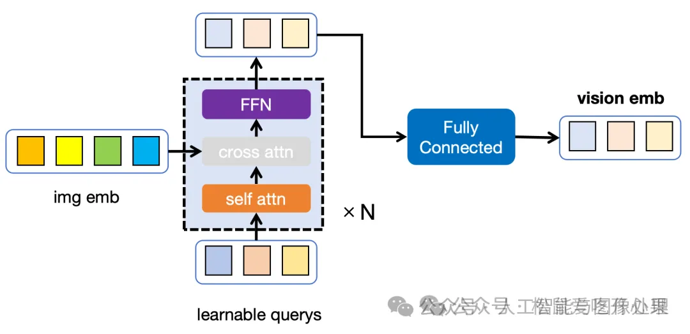

Q-Former 包含两个Transformer, 但是其中的self-attention是共享的.

1. 一个image Transformer. 有self-attn, FFN, 还有一个cross-attn
2. 一个text Transformer. 只有self-attn和FFN

Q-Former是从BERT初始化的, 所以确实就是encoder架构, 不过在self-attn和FFN之间加了cross-attn

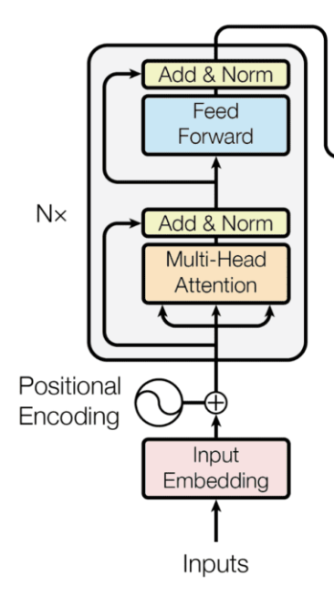

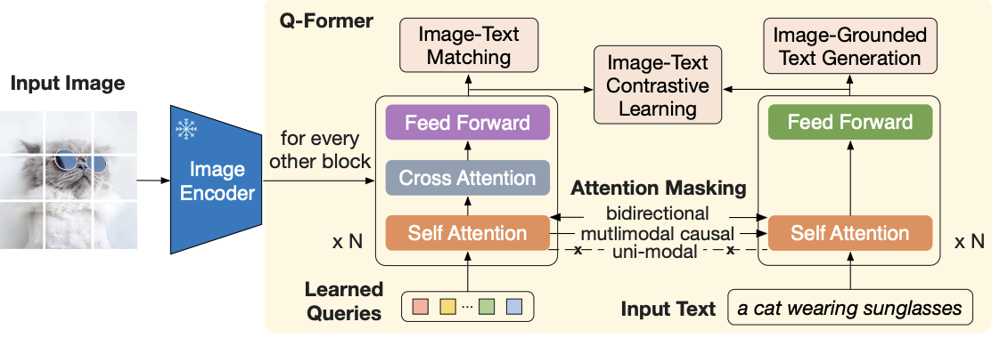

第一阶段训练任务:

1. ITC(Image-Text Contrastive Learning)
   对齐图像和文本的embedding. 采用单模态自注意力掩码, 不允许Query和Text相互关注
2. ITG(Image-grounded Text Generation)
   在给定输入图像作为条件的情况下，训练 Q-Former 生成文本(直接作为解码器, 而不用后面的LLM)，迫使Query提取包含文本信息的视觉特征。

3. ITM( Image-Text Matching)
   预测图像-文本对是正匹配还是负匹配，学习图像和文本表示之间的细粒度对齐。使用双向自注意掩码，所有Query和Text都可以相互关注。

第二阶段训练任务:

1. 在生成预训练阶段，将 Q-Former连接到冻结的 LLM，以利用 LLM 的语言生成能力。这里**使用全连接层**将输出的Query嵌入线性投影到与 LLM 的文本嵌入相同的维度，然后将投影的Query嵌入添加到输入文本嵌入前面由于 Q-Former 已经过预训练，可以提取包含语言信息的视觉表示，因此它可以有效地充当信息瓶颈，将最有用的信息提供给 LLM，同时删除不相关的视觉信息，减轻了 LLM 学习视觉语言对齐的负担。


## **LLaVA**

论文发布时间：  

- 2023年4月（初版）  
- 2023年12月（更新）

模型结构：  

- **视觉编码器（Vision Encoder）**：预训练的 CLIP visual encoder ViT-L/14（分辨率 224×224）  
- **语言大模型（LLM）**：Vicuna  
- **投影层（Projection）**：一个简单的线性层，用于将图像特征映射到词嵌入空间

不同于 Flamingo 的 gated cross-attention 和 BLIP-2 的 Q-former，LLaVA 的映射层较为简单，便于以数据为中心进行实验迭代。

训练方法：  

- **阶段一：特征对齐的预训练（Pre-training for Feature Alignment）**  
  - 冻结视觉编码器和 LLM，只训练投影层。  
  - 选取了 CC3M 数据集中过滤后的 595K 图文对，并将这些图文对改造为指令跟随数据（每个样本构成一个单轮对话），目标输出为图像的原始描述文本。  
  - 本阶段实质上为冻结的 LLM 训练了一个兼容的视觉 tokenizer，使得视觉编码器输出的图像特征可以和预训练 LLM 的词向量对齐。  
  - 训练配置：  
    - 数据集：CC-595K 过滤后的子数据集  
    - Epoch 数：1  
    - 学习率：2e-3  
    - Batch_size：128

- **阶段二：端到端微调（Fine-tuning End-to-End）**  
  - 冻结视觉编码器，训练投影层和 LLM。  
  - 两个实验设置：  
    - **多模态对话机器人**：  
      - 使用 158K 的语言-图像指令跟随数据对 Chatbot 进行微调开发。  
      - 样本类型包括：  
        - 对话型（多轮交互式）  
        - 其他两种单轮交互式回答  
      - 在训练过程中，这些样本被均匀采样使用。  
    - **ScienceQA 数据集**：  
      - ScienceQA 包含 21,000 个多模态多项选择题，涵盖广泛领域（3 个学科、26 个主题、127 个类别、379 项技能）。  
      - 数据集划分：  
        - 训练集：12,726 个样本  
        - 验证集：4,241 个样本  
        - 测试集：4,241 个样本  
      - 训练配置：  
        - 基于 LLaVA-Instruct-158K 数据集  
        - Epoch 数：3  
        - 学习率：2e-5  
        - Batch_size：32

---

## **LLaVA-1.5（通过视觉指令微调改进基线性能）**

论文发布时间：2023年10月

基于 LLaVA 的改动点：  

- 明确指定输出格式的提示  

  - 为解决短文本 VQA 和长文本 VQA 输出兼容问题，在短文本回答中明确指定输出格式提示。  
  - 例如，在问题文本末尾添加 “Answer the question using a single word or phrase”，使模型根据用户指示适当调整输出格式。

- 使用两层 MLP 作为视觉-语言连接器  

  - 相比 LLaVA 的单个线性投影层，两层 MLP 能够增强连接器的表达能力，从而显著提升多模态能力。

- 添加特定任务的数据集  

  - 为增强模型在不同能力上的表现，不仅增加 VQA 数据集，同时专注于 OCR 以及区域级别识别的四个数据集。  
  - 数据集示例：  
    - 需要广泛知识的 VQA（如 OKVQA 和 A-OKVQA）  
    - 需要 OCR 的 VQA（如 OCRVQA 和 TextCaps）

- 规模扩大  

  - 图片分辨率提升至 336（通过将视觉编码器替换为 CLIPViT-L-336px）。

- 引入 anyres  

  - 痛点：不论使用 ViT-L/14-224px 还是 ViT-L/14-336px，都只能支持固定分辨率的图像作为输入。  

  - 目标：支持任意高分辨率的图像。  

  - 核心思路：将图片切分成多个 patch，分别获得 patch 的图像特征。  

  - 方法：  

    - split原图：将一张图片切分成若干个 patch，单独对每个 patch 进行 encoder 编码，组合为一个更大的图片特征。  
    - resize原图：将图片 resize 到固定尺寸 336×336，作为全局上下文（Global context）加入到图片特征中。

    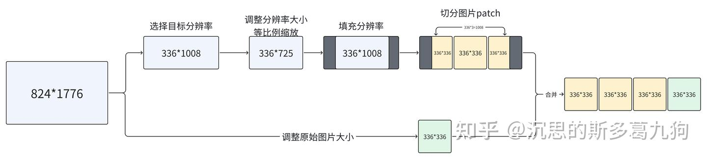

- 新增数据集  

  - 加入 GQA 数据集，作为额外的图片知识。  
  - 加入 ShareGPT 数据。  
  - 扩大 LLM 至 13B 参数。  
  - 在 MM-Vet 上的结果表明，当 LLM 扩展至 130 亿参数时，改进最为显著，说明基础 LLM 的能力对于视觉对话至关重要。

---

## **LLaVA 1.6 (LLaVA-NeXT)**

改进相较于 LLaVA-1.5：  

- 推理、OCR 和世界知识方面的显著提升  
  - 在多个基准测试上超过 Gemini Pro 的表现。

- 图像输入改进  
  - 将输入图像分辨率提高 4 倍，以捕捉更多视觉细节。  
  - 支持三种不同的宽高比，最高可达：  
    - 672×672  
    - 336×1344  
    - 1344×336

- 微调数据混合改进  
  - 通过改进视觉指令微调数据混合，进一步提升视觉推理和 OCR 能力。

- 扩展视觉对话能力  
  - 针对更多场景优化视觉对话功能，涵盖不同应用领域，同时增强了模型的世界知识和逻辑推理能力。

- 部署与推理  
  - 采用 SGLang 实现高效部署与推理。  

- 数据效率  
  - LLaVA-NeXT 重用了 LLaVA-1.5 预先训练的连接器，并且仅使用了少于 100 万的视觉指令微调样本。  

- 训练配置示例  
  - 最大版（340 亿参数）在 32 块 A100 显卡上，约 1 天即可完成训练。


## Qwen-VL

基本架构

1. LLM：使用了来自Qwen-7B模型的预训练权重
2. 视觉编码器：采用了Vision Transformer（ViT）架构，用于处理输入图像并生成一组图像特征。在训练和推理过程中，将输入图像调整到特定的分辨率，然后通过将图像分割成大小为14的图块来处理它们。预训练权重来自于OpenAI的clip的[ViT-bigG](https://zhida.zhihu.com/search?content_id=249031429&content_type=Article&match_order=1&q=ViT-bigG&zhida_source=entity)。
3. 位置感知的视觉-语言适配器（Position-aware Vision-Language Adapter）：为了缩短图像token长度，同时作模态映射的模块。由一个单层的交叉注意力模块构成，使用一组可训练的向量（嵌入）作为查询向量，使用来自视觉编码器的图像特征作为交叉注意力操作的键。随机初始化。

位置感知的视觉-语言适配器（Position-aware Vision-Language Adapter）
作用
该组件的作用在于使得长序列的图像特征变得更加紧凑，从而提高了处理效率。同时，考虑到位置信息可以帮助模型更准确地理解图像细节，因此在压缩过程中保留了这方面的信息。

实现
该适配器由一个单层交叉注意力模块组成。 模块使用一组可训练的向量（嵌入）作为查询向量，使用来自视觉编码器的图像特征作为键进行交叉注意力操作。 将图像特征序列压缩成了固定长度的256。 考虑到图像中位置信息的重要性，作者引入了2D绝对位置编码到交叉注意力机制的查询-键对中。

stage1：预训练，目标是使用大量的图文对数据对齐视觉模块和LLM的模态，这个阶段冻结LLM模块的参数； stage2：多任务预训练，使用更高质量的图文多任务数据（主要来源自开源VL任务，部分自建数据集），更高的图片像素输入，全参数训练； stage3：指令微调阶段，这个阶段冻结视觉Encoder模块，使用的数据主要来自大模型Self-Instruction方式自动生成，目标是提升模型的指令遵循和多轮对话能力。

***

**之前的多模态大模型通常是基于单个图片做多轮对话，且不能给出图中某个物体的具体位置**。QWenVL更改了模型的输入输出格式，并用标记语言(类似html)和Tokenizer来适配多图多轮对话和目标检测任务。Assistant后面为语言模型需要生成的内容，其他内容均为Prompt。为了方便读者理解，下述例子与QWenVL的真实输入输出略有出入。

```
其他多模态大模型的输入输出格式, "..."表示图1中的aligned img emb
...</img>
User:请给出图中的动物的种类
Assistant:熊猫
User:请给出图中共有多少只熊猫
Assistant:5个

QWenVL中适配多张图片的输入输出格式
User: Picture 1img_path_1</img>, 请给出图中动物的种类
Assistant:老虎
User: Picture 2img_path_2</img>, 请判断上述两张图中共有多少只动物
Assistant:10只
User: 请给出图1中老虎的位置
Assistant:<ref>老虎</ref><box>(10,12),(120,130)</box>
```

QwenVL的Tokenizer在接受Prompt的时候会自动识别Prompt中表示图像地址的部分，然后将该地址pad到固定长度256。在模型进行forward的时候，会识别图片地址的位置并通过图1中的Image Encoder和Adapter将图片转为长度为256的序列(aligned img emb)，并将该序列替换掉Prompt中的图片地址。

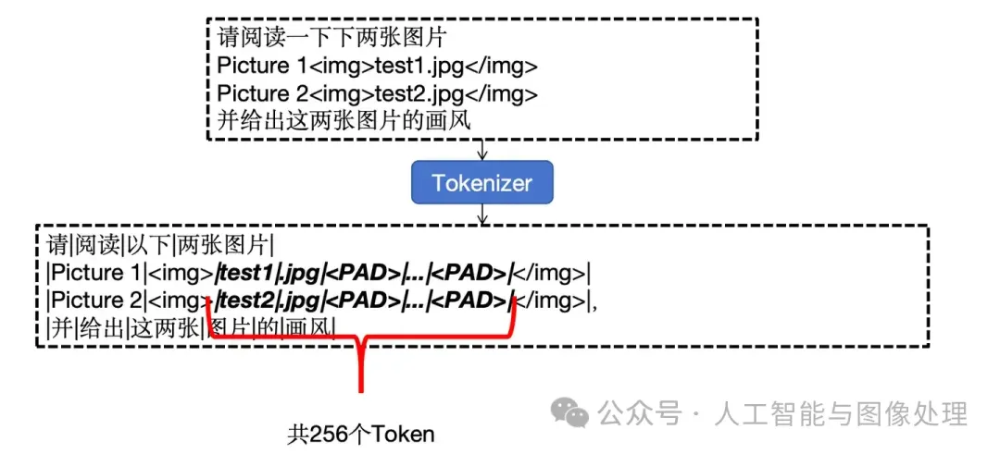

QWenVL还能给出图中物品的类别和坐标，表示方法为

```
<ref>类别</ref><box>(min_x,min_y),(max_x,max_y)</box>
```

QWenVL用特定格式的输出表示检测框位置和被检测物体的类别，其坐标直接使用Token表示，坐标是将图片进行等比例缩放直到最长边为1000后图片上的坐标。这种使用Token表示坐标的方式非常反直觉，但确实能Work。


QWenVL使用FC层和单层Cross Attention作为将视觉模态Adapter。 与之前介绍的Adapter不同，QWen先使用FC层将图像特征的维度对齐到大模型，再使用Cross Attention将图像特征的长度变为指定的长度，其先使用FC，再使用Cross Attention的做法可能是为了增加Adapter的参数量。

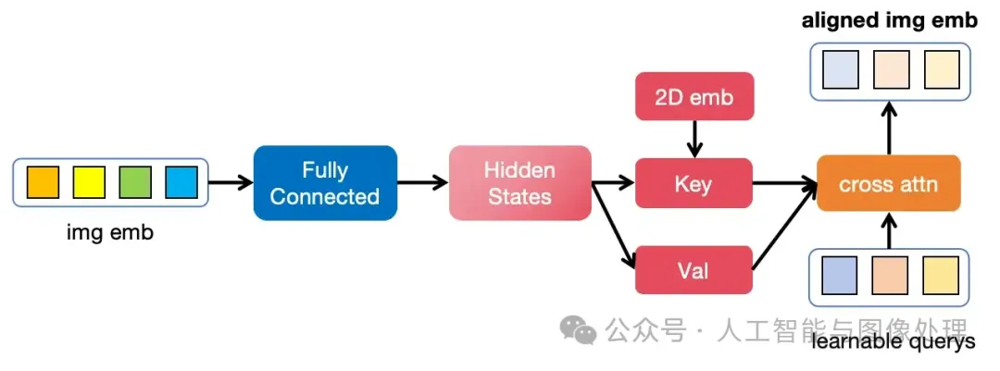

除此之外，QWenVL的Adapter还在图像的位置信息上做了一点调整。之前的多模态大模型使用的视觉Encoder通常是将图像的patch按从上到下，从左到右的顺序排序成一个序列(图2中的img emb)，并按照序列的顺序给图像加入位置信息emb(1D位置emb)。除此之外，此前介绍的多模态大模型并未关注图像emb的位置信息。

除了来自视觉模型的1D位置emb，QWenVL还在Adapter中的cross attn中加入了2D位置emb。其具体做法是将2D位置emb加到cross attn中的Key上，2D位置emb表示该patch是图像分块后的第几行和第几列，是通过分别计算行、列的1D位置emb再concat到一起得到的，其中行、列的1D位置emb来自sin位置emb。显然的，加入的2D位置emb对于不同长宽比的图片会更加友好，虽然QWenVL输入的图片有着固定的大小，但这可能是为后续的QWenVL-Plus/QWenVL-Max打下的基础。

**与LLaVA，Mini-GPT4不同QWenVL的训练被分为三个阶段**，分别是**特征对齐训练**，**能力增强训练**和**指令跟随训练**，不同阶段的模型可训练参数也各不相同。

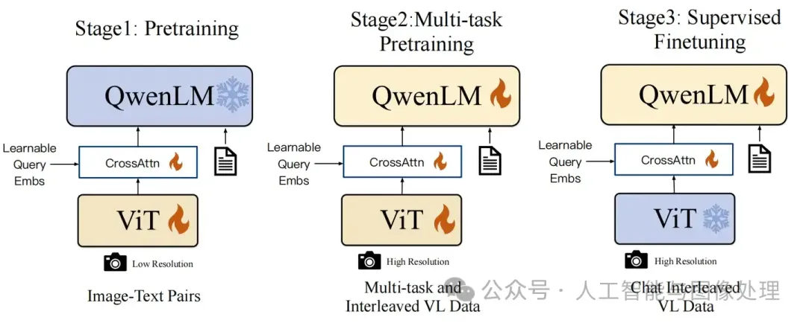

**2.3.1 特征对齐训练**

特征对齐训练是使用大量的图文对数据(img-caption)将视觉Encoder对齐到LLM上去，让LLM能看到图片上的信息。其特点是数据量大，文字内容小(seq_len较小，256图像 + 512LLM)，训练速度快(因为seq_len小，所以训练速度相对较快)。QWenVL从各种开源数据集中收集了1.4B的数据，其中77.3%为英文数据，22.7%为中文数据，具体数据来源见表1。

训练时图像被缩放至224*224的大小，batch-size 为30720，训练了50K步，训练时Vision Encoder和Adapter的权重有更新。其输入输出格式如下

```
User: Picture 1tiger.jpg</img>
Assistant:5只老虎在大草原上捕猎
```

**2.3.2 能力增强训练**

在将Image Encoder对齐到大模型后，QWenVL将输入的图像大小从224 * 224 调整到 448 * 448，并使用了7个不同的训练任务来增强模型的能力。模型的全部参数均参与训练，训练的seq_len为2048。

**2.3.3 指令跟随训练**

该阶段主要是让模型拥有聊天的能力，模型开放Adapter和LLM的参数用于训练。QWenVL使用了基于LLM生成多模态的对话数据，并保证对话内容和图像内容相关，指令微调数据量为359K，论文中并未具体给出数据生成的方法。


## InternVL-v1.5


模型上，internVL-v1.5首次将ImageEncoder(VIT)的参数量扩展到了6B，将图像的视觉特征（图1中的aligned img emb）扩展到了1.7k，将图像的分辨率提升到7个448 * 448的patch(后续会解释)，并引入了动态长宽比。数据上，InternVL-v1.5不仅收集了大量自然场景数据，还收集了大量文档数据，进一步提升算法的OCR能力。

|               | VIT的参数量 | 图像分辨率 | 视觉特征序列长度 | 动态长宽比 |
| ------------- | ----------- | ---------- | ---------------- | ---------- |
| 第一阶段模型  | <300M       | 448*448    | 512              | 不支持     |
| InternVL-V1.5 | 6B          | 448*448*7  | 1792             | 支持       |

***

动态分辨率

此前，多模态大模型通常是将图像resize到固定的长宽比(448 x 448 或 1344 x1344)，再送入VIT获取图像特征，这种做法会造成两个问题：

1. 对于极端长宽比的图片，失真严重
2. 若固定一个较大的长宽比（比如1344*1344），则VIT会产生超长的序列长度，消耗大量算力


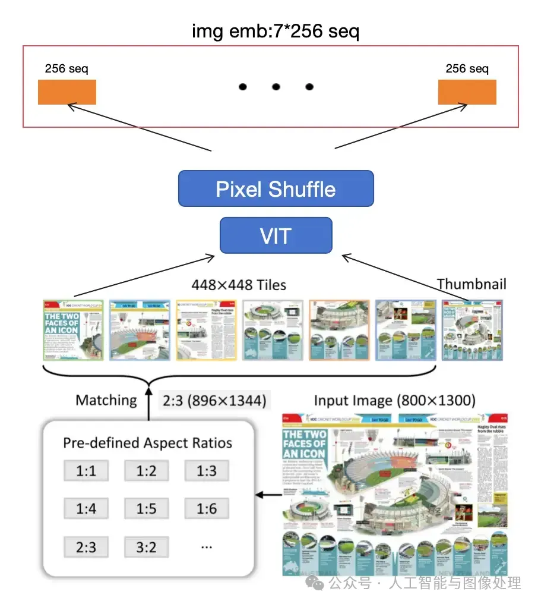

动态长宽比的实现分为以下4个步骤：

1. 预设最大patch数量：max_patches，图像会被分为多个448x448的patch，但会保证patch数不超过max_patch，图2中max_patches被设为7
2. 根据最大patch数量给出能够适配的长宽比（长 * 宽 <= max_patch - 1），图2左下部分即为max_patches=7时候能够适配的部分长宽比
3. 根据原图分辨率和原图长宽比，给出最匹配的长宽比（图2中为 2:3），并将图片resize并分为多个448 x448的patch（图2中，想将图片从[800, 1300] resize成 [448x2 = 896, 448x3 =1344]，再将其切片成为 2x3=6个 448x 448 的patch）
4. 最后将原图resize到448x448放在patch的后面，就得到了图像经过动态长宽比后的图片（图2中部小图）
5. 这些小图分别经过VIT后会得到max_patch个1024长度的序列，将这些序列拼接起来即可得到图像序列

这样做的好处是

1. 可以处理较为极端长宽比的图像，避免了因resize导致的图像变形
2. 大分辨率图对应的序列长度较长，小分辨率图对应的序列长度较小
3. 将图片切成了多个448x448的小片过VIT，采用了分块的思想，解决了大分辨率图像计算量大的问题。


***

| 模型尺度                 | VIT模型大小固定在675M；LLM大小分为1.5B，7.6B和72B三个版本    |
| ------------------------ | ------------------------------------------------------------ |
| 图像预处理               | 不仅关注图像宽高，还关注图像分辨率。分辨率越高的图像，使用更多的视觉token来表示 |
| 统一的多模态Rope位置编码 | 开发了一套位置编码，用于表示视觉视频和文字的位置信息         |

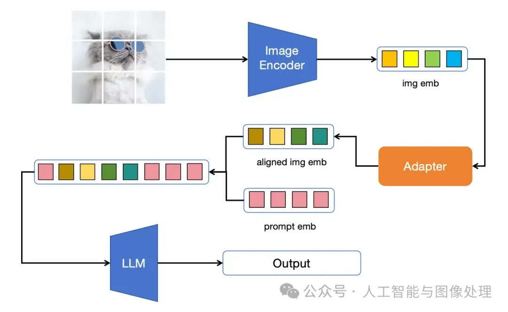

InternVL系列的图像转序列(img_emb)模块会将图像分为多个448*448的patch，即图像的长宽会被resize到448的倍数，该方法虽然能支持动态长宽比，但实际应用时，该图像分patch机制更多考虑的是长宽比，而非分辨率。

| 使用模型      | 图像分辨率 | resize后分辨率 | 图像序列长度 |
| ------------- | ---------- | -------------- | ------------ |
| InternVL-v1.5 | 512x512    | 448x448        | 256          |
| InternVL-v1.5 | 40x400     | 448x4480       | 2560         |
| Qwen2VL       | 512x512    | 504x504        | 324          |
| Qwen2VL       | 40x400     | 28x392         | 14           |

***


## Qwen2-VL

新的图解参考: 

https://zhuanlan.zhihu.com/p/25267823390

https://zhuanlan.zhihu.com/p/28205969434


***


而Qwen2VL的图像转序列不仅考虑了长宽比还考虑了分辨率对img_emb序列长度的影响, 极大程度上提升了模型的infer效率。其实现动态分辨率的具体做法分为图像预处理和VIT两个部分。

**图像预处理部分：**以512x512的图像为例，该图像会被resize成504x504, 保证能整除28x28(14x14+后面的pixel shuffling)；然后被分为 36x36个patch，每个patch的大小均为14x14x3；随后channel维度进行重复得到  36x36个patch，每个patch的大小均为14x14x3x2；最后会对图像进行flatten操作，得到(36x36, 14x14x3x2) = （1296, 1176）的序列。

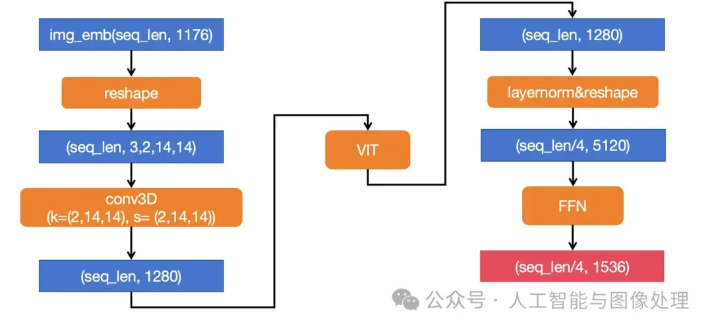

注意, 最后看qwen2.5和qwen2, 最后mlp得到的维度是3584, 而非1536

***

4. 


***

基本架构
LLM+视觉编码器结构，无adapter。 LLM：Qwen2 视觉编码器：实现了一种具有大约675百万参数的ViT，能够处理图像和视频输入。

原生动态分辨率 Naive Dynamic Resolution
Qwen2-VL现在可以处理任意分辨率的图像，动态将其转换为可变数量的视觉tokens。为支持此功能，修改了ViT，去除了原始的绝对位置嵌入，并引入了2D-RoPE，以捕捉图像的二维位置信息。


在推理阶段，不同分辨率的图像被打包成一个单一序列，打包长度受到控制，以限制GPU内存使用。此外，为减少每幅图像的视觉tokens，在ViT后采用了一个简单的多层感知器（MLP）层，将相邻的2×2个tokens压缩为一个token，并在压缩的视觉tokens的开头和结尾放置特殊的<|vision_start|>和<|vision_end|> tokens。因此，分辨率为224×224的图像在使用patch_size=14的ViT编码后，将在进入LLM之前压缩为66个tokens（16*16/4+2）。

训练
遵循Qwen-VL，采用三阶段训练方法。 1. Stage1： 专注于训练ViT组件，利用大量图像-文本对提升大型语言模型（LLM）的语义理解。 2. Stage2：全参训练，使用更广泛的数据进行更全面的学习。 3. Stage3：冻结ViT，使用指令数据集进行LLM的微调。

Stage1 预训练
包括图像-文本对、光学字符识别（OCR）数据、交错的图像-文本文章、视觉问答数据集、视频对话和图像知识数据集。数据源主要来自清理过的网页、开源数据集和合成数据，数据截止日期为2023年6月。

在初始预训练阶段，Qwen2-VL接触到约6000亿个tokens。Qwen2-VL的LLM组件使用Qwen2中的参数初始化，而视觉编码器则基于DFN的ViT初始化。原DFN ViT中的固定位置embedding被RoPE-2D替代。此阶段主要学习图像-文本关系、通过OCR进行文本内容识别、图像分类任务，为模型建立视觉-文本关联的扎实基础。

Stage2 多任务预训练
涉及额外的8000亿个与图像相关的数据。此阶段引入了更多混合图像-文本内容，促进了对视觉和文本信息之间相互作用的更细致理解。视觉问答数据集的纳入提升了模型对图像相关查询的响应能力，同时，多任务数据集的引入对模型同时处理多种任务的能力至关重要，这在处理复杂的现实世界数据集时尤为重要。纯文本数据继续在维持和提高模型语言能力方面发挥关键作用。

在整个预训练阶段，Qwen2-VL处理了总计1.4万亿个tokens，包括文本tokens和图像tokens。然而，训练过程中仅对文本tokens提供监督。

Stage3 指令微调
采用ChatML格式构建指令跟随数据集。该数据集不仅包括纯文本对话数据，还包含多模态对话数据。包括：图像问答、文档解析、多图像比较、视频理解、视频流对话和基于代理的交互。


## LLaVA 的anyres 是怎么处理的

输入的图片在get_item的时候就被送去打成patch:

在anyres的设置下, 会先找到最佳分辨率(可选择的[[336, 672], [672, 336], [672, 672], [1008, 336], [336, 1008]])

> *在选择最佳分辨率时，会考虑将原始图像隐式缩放 （通过计算缩放比例 scale 和下采样尺寸）到每个可能的候选分辨率，然后基于有效像素利用率（最大化）和像素浪费（最小化）来确定最佳选择*

然后拉伸, `image_padded = resize_and_pad_image(image, best_resolution)`

然后打成patch `patches = divide_to_patches(image_padded, processor.crop_size['height'])`, 分成多个336*336的图


图片经过vit (使用14x14的patch), vit每一个block输出都是[5,577,1024], 第一个是5张图片, 其中1张原图, 4张patches

只取最后一个[5, 576, 1024]

## Qwen2.5-VL/有自己理的视觉处理过程

参考:

https://zhuanlan.zhihu.com/p/1921289925552210138

```python
# 读取用于处理数据中图像和文本的processor，细节如下：
#（1） 默认情况下，在qwen2.5 LM Decoder的输入中，一张图片最少占据4个token，最多占据16384个token
# (2) 你也可以自己权衡模型效果和计算成本，自行设定一张图片最少/最多占据的token数量，
#     然后把这个自定义值传入process初始化的参数重，例如：
#     min_pixels = 256*28*28，你希望一张图片最少占据256个token，由于每个token对应一块28*28的区域，所以这张图片至少拥有256*28*28个pixel
#     max_pixels = 1280*28*28，道理同上
#     processor = AutoProcessor.from_pretrained("Qwen/Qwen2.5-VL-7B-Instruct", min_pixels=min_pixels, max_pixels=max_pixels)
# 
#     这里，取28是因为，最初的patch_size我们打算设为14，由此得到原始patch，这也是vit部分的输入。
#     但在vit输出层，为了进一步节省token，我们决定将 2*2 个patch合并起来作为一个token
#     这个token才是最后作为qwen2.5 LM Decoder的vision部分输入，所以是14*2 = 28
```

***

qwen2.5-vl的代码: https://github.com/huggingface/transformers/blob/41925e42135257361b7f02aa20e3bbdab3f7b923/src/transformers/models/qwen2_5_vl/modeling_qwen2_5_vl.py#L404

参考: https://zhuanlan.zhihu.com/p/1921289925552210138

假设有一个视频帧224x224大小, 然后有6帧.

1. 首先视频每一帧会检查是否超过min_pixel, max_pixel, 然后是否能被28x28整除(因为后面要打成14x14的patch, 再后面要再进行2x2的pixel shuffing)

2. 然后这个视频帧序列就会被reshape成`(-1, 2*3*14*14)`, 其中`14*14*3`就是H,W,C维度, 然后其中的2是时间维度, 要为后续准备3D卷积做准备. 然后这一步视频帧序列的形状就变成了`(256,2*3*14*14)`, 即`(256, 1176)`. 

3. 然后此时`Qwen2_5_VisionPatchEmbed`对于`(768, 1176)`再用1280个卷积核为`(2,14,14)`的3D卷积去过一遍, 最终得到`(768,1280)`, 然后输入给ViT处理(`Qwen2_5_VisionTransformerPretrainedModel)`, 最后ViT输出`(768,1280)`.

4. 最后由`Qwen2_5_VLPatchMerger`进行pixel shuffling (patch merge), 来减少token 数量, 就是空间维度缩小一倍(长和宽都缩小一倍, 面积缩小到1/4). 
   具体的就是输入reshape成`(768/4, 1280*4)`, 即`(64, 5120)`,然后用一个MLP去降维, 最终变成`(192,3584)`. 最终就是有192个token.

   ```python
   class Qwen2_5_VLPatchMerger(nn.Module):
       def __init__(self, dim: int, context_dim: int, spatial_merge_size: int = 2) -> None:
           super().__init__()
           self.hidden_size = context_dim * (spatial_merge_size**2)
           self.ln_q = Qwen2RMSNorm(context_dim, eps=1e-6)
           self.mlp = nn.Sequential(
               nn.Linear(self.hidden_size, self.hidden_size),
               nn.GELU(),
               nn.Linear(self.hidden_size, dim),
           )
   
       def forward(self, x: torch.Tensor) -> torch.Tensor:
           x = self.mlp(self.ln_q(x).view(-1, self.hidden_size))
           return x
          	
   #self.merger = Qwen2_5_VLPatchMerger(
   #    dim=config.out_hidden_size, # Qwen2.5-VL-7B的config定义了"out_hidden_size": 3584
   #    context_dim=config.hidden_size,
   #    spatial_merge_size=config.spatial_merge_size,
   #)
   ```

   

# RL

## 术语

MDP: 马尔科夫决策过程

Policy: 常见符号是$\pi(动作|状态)$. 给定输入状态情况下采取动作的概率. 这个Policy感觉其实就可以指代我们的model, 或者模型输出的结果(logits), 类似于`model()`

状态价值函数: 常见符号是$V$, 就是总的期望收益

动作价值函数: 常见符号是$Q$, 就是一个动作的收益. 

on-policy: 数据采样的来源和要更新的模型是一个模型

off-policy: 数据采样的来源和要更新的模型不是一个模型

策略梯度算法: 就是policy-based的方法, 和什么Q-Learning, DQN有区别, 这些是Value-based的算法. 策略梯度算法就是对策略参数化, 用神经网络来建模(就是神经网络就是这个策略), 策略学习的目标函数就是$V$. 学习的方法就是梯度上升. 策略梯度算法属于on-policy的算法

Actor-Critic算法: Actior就是Policy, Critic就是$V$

优势函数: $A=Q-V$


## RLHF

RLHF的三个阶段:

1. 用偏好数据进行SFT
2. 训练Reward Model, 用来为模型输出的完整序列(注意不是token-level)打分, 提供奖励信号
3. 进行PPO训练

### 1. 训练Reward Model

用类似以下形式的偏好数据:


Reward Model 就直接拿一个LLM来魔改就行了, 把最后的lm-head改成输出维度为1的score head, 我们直接拿这个head的logit作为分数:

* 原本是: `nn.Linear(hidden_size, vocab_size)` 原本的维度是hidden_size, 然后改成了词表大小, 表示该token对每个词的概率
* 改成`nn.Linear(hidden_size, 1)`, 原本维度是hidden_size, 然后直接变成一个标量
* 最终Reward Model就是拿`reward = self.reward_head(hidden[:, -1, :])  # [batch, 1]`, 就是最后一个token的标量, 来作为Reward的值.

而且只对序列最后最后一个token调用这个score head就行了, 因为反正看到了前面的所有内容, 相对于对前面所有内容进行打分

训练的时候就是用Bradley-Terry模型来进行训练, 就是两两比较:

- 对于人类偏好 y₁ > y₂ 的比较对，训练目标是让 R(y₁) > R(y₂)
- 损失函数通常是：`Loss = -log(σ(R(y₁) - R(y₂)))` (直观上就是希望R(y_1)比R(y_2)大就行了)
- 其中σ是sigmoid函数，R是reward model的输出

注意这里的Reward Model是sentence level的:

- 人类评价文本时看的是整体质量
- 有用性、无害性、诚实性都是整体概念


### 2. PPO

这里讨论第三个阶段:

有四个角色:

* Actor Model: 我们训练的模型, 就是Policy, 初始化就是SFT阶段产出的模型 (要更新)

* Critic Model: 预估总收益的模型, 就是$V$, 初始化从Reward Model开始初始化. (在这阶段要更新), 注意Critic Model是token-level. 

  > Critic Model不是提供额外的奖励来源，而是通过学习预测未来的期望回报，提供了一个动态的基准，用来校准 Reward Model 提供的原始奖励信号，生成更稳定、信息量更大的 Advantage 信号，从而稳定并加速 PPO 的训练

* Reward Model: 计算一个动作的收益, 就是$Q$ (此阶段冻结, 它在前一个阶段已经训练完了), 注意这里的Reward Model是sentence level的

* Reference Model: SFT阶段产出的模型 (此阶段冻结), 用于计算KL散度惩罚


```python
# 伪代码流程
for epoch in range(num_epochs):
    # Step 1: 采样生成
    prompts = sample_prompts(batch_size)
    responses = actor_model.generate(prompts)  # 生成回复
    
    # Step 2: 计算奖励
    rewards = reward_model(prompts + responses)  # 使用RM评分
    kl_penalty = compute_kl_divergence(actor_model, reference_model)
    final_rewards = rewards - kl_penalty  # 防止偏离太远
    
    # Step 3: 计算价值函数
    values = critic_model(prompts + responses)
    
    # Step 4: 计算优势函数
    advantages = compute_gae(rewards, values)  # GAE算法
    
    # Step 5: PPO更新
    for _ in range(ppo_epochs):
        # 计算新旧策略比率
        ratio = new_policy_prob / old_policy_prob
        
        # PPO clip损失
        clipped_ratio = torch.clamp(ratio, 1-clip_epsilon, 1+clip_epsilon)
        policy_loss = -torch.min(ratio * advantages, 
                                clipped_ratio * advantages)
        
        # 更新actor
        actor_optimizer.step()
        
        # 更新critic
        value_loss = mse_loss(values, returns)
        critic_optimizer.step()
```


***

为什么需要Ctiric Model:

在token-level的生成过程中：

``` python
# t=0: "请问如何"
# t=1: "请问如何学习"  
# t=2: "请问如何学习Python"
# t=3: "请问如何学习Python？建议..." (完成)

# Critic对每个状态的价值估计：
V(t=0) = critic("请问如何")
V(t=1) = critic("请问如何学习") 
V(t=2) = critic("请问如何学习Python")
V(t=3) = critic("请问如何学习Python？")

current_value = V(t=2) = critic("请问如何学习Python")     # 当前状态价值
next_value = V(t=3) = critic("请问如何学习Python？")      # 下一状态价值
reward = 0  # 中间步骤通常没有即时奖励，只有最后一步有
advantage(t=2) = ... #(这里应该是要用GAE算)
```

Reward Model只能在t=3时给出奖励 (因为Reward Model是sentence-level的)

但我们需要知道中间过程t=0,t=1,t=2状态的价值

知道了对应状态的价值(就是最前面actor-critic model的$V$)

这里直观上就是中间过程是需要对token去算优势的, 所以需要token-level的Critic Model

***

优势的计算:

$$A(s,a) = Q(s,a) - V(s)$$

问题是：我们没有真实的 $Q(s,a)$ 和 $V(s)$，只能通过神经网络估计！

实际中我们有：
- $V_\phi(s)$：Critic网络对状态价值的估计
- 无法直接估计 $Q(s,a)$，需要其他方法
  - 如果直接建模 $Q(s,a)$：
    - 输入：状态序列 + 具体的token
    - 输出：标量Q值
    - 问题：对于每个状态，需要计算50k+个不同动作的Q值
  - 而建模 $V(s)$：
    - 输入：状态序列  
    - 输出：标量V值
    - 只需要一次前向传播

```python
# 每个token位置的状态价值 V(s_t)
critic_values = [
    0.1,  # V("The")
    0.3,  # V("The weather") 
    0.5,  # V("The weather is")
    0.7,  # V("The weather is nice")
    0.8   # V("The weather is nice today")
]

final_reward = 2.5  # 整个回答的质量分数

# 只有最后一个token得到reward，其他都是0
rewards = [0.0, 0.0, 0.0, 0.0, 2.5]  # r_0, r_1, r_2, r_3, r_4

def compute_token_advantages(critic_values, final_reward, gamma=0.99, lam=0.95):
    n_tokens = len(critic_values)
    advantages = [0.0] * n_tokens
    
    # 构造奖励：只有最后一个token有奖励
    rewards = [0.0] * (n_tokens - 1) + [final_reward]
    
    gae = 0.0
    # 从最后一个token开始往前算
    for t in reversed(range(n_tokens)):
        if t == n_tokens - 1:  # 最后一个token
            # δ_t = r_t + γ * 0 - V(s_t)  (序列结束，next_value=0)
            delta = rewards[t] - critic_values[t]
        else:  # 中间的token
            # δ_t = r_t + γ * V(s_{t+1}) - V(s_t)
            delta = rewards[t] + gamma * critic_values[t+1] - critic_values[t]
        
        # GAE递归：A_t = δ_t + (γλ) * A_{t+1}
        gae = delta + gamma * lam * gae
        advantages[t] = gae
    
    return advantages
```


## GRPO (京东)

损失函数:
$$
\begin{aligned}
\mathcal{J}_{G R P O}(\theta) & =\mathbb{E}_{\left[q \sim P(Q),\left\{o_i\right\}_{i=1}^G \sim \pi_{\theta_{o l d}}(O \mid q)\right]} \\
& \frac{1}{G} \sum_{i=1}^G \frac{1}{\left|o_i\right|} \sum_{t=1}^{\left|o_i\right|}\left\{\min \left[\frac{\pi_\theta\left(o_{i, t} \mid q, o_{i,<t}\right)}{\pi_{\theta_{o l d}}\left(o_{i, t} \mid q, o_{i,<t}\right)} \hat{A}_{i, t}, \operatorname{clip}\left(\frac{\pi_\theta\left(o_{i, t} \mid q, o_{i,<t}\right)}{\pi_{\theta_{o l d}}\left(o_{i, t} \mid q, o_{i,<t}\right)}, 1-\varepsilon, 1+\varepsilon\right) \hat{A}_{i, t}\right]-\beta \mathbb{D}_{K L}\left[\pi_\theta| | \pi_{r e f}\right]\right\}
\end{aligned}
$$
其中优势函数为:
$$
\hat{A}_{i, t}=\frac{R_i-\operatorname{mean}\left(\left\{R_j\right\}_{j=1}^G\right)}{\operatorname{std}\left(\left\{R_j\right\}_{j=1}^G\right)}
$$


* KL散度是用来防止RL Policy的过度优化, 在InstructGPT的PPO实现中被使用了

***

GRPO和PPO的区别:

* 没有了Critic Model (或者说是Value Model): 不需要一个额外的价值模型来给打一个「绝对分」，而是采样多次，直接用奖励模型的平均值来充当这个「基线」
* 注意Reward Model还是可以在的, 只是可以替换成Rule-based

***

ms-swift的伪代码实现:

``` python
# ========== 1. 进行rollout ==========
prompt = "Question: Which is bigger? 9.11 or 9.9?"

# Generate multiple completions through parallel sampling
completions = rollout_function(
    model=current_policy_model, # 注意采样用的是在线的?
    prompt=prompt,
    num_generations=8,  # Hyperparameter: number of samples per prompt
    temperature=1.0     # Hyperparameter: sampling diversity
)

# ========== 2. 计算Reward, 基于规则 ==========
# Evaluate generated completions using reward model
rewards = reward_function(
    completions=completions,
    ground_truth="9.11"  # Expected correct answer
)


# 对归一化进行标准化, 然后就可以得到相对优势
rewards_mean = mean(rewards)  # μ = 0.5
rewards_std = std(rewards)    # σ = 0.25
advantages = (rewards - rewards_mean) / (rewards_std + 1e-8)  # Standardization


# ========== 3. Policy Optimization Phase ==========
# Get token-level log probabilities from different models
current_logps = get_per_token_logps(current_policy_model, prompt, completions)  # π_θ
old_logps = get_per_token_logps(old_policy_model, prompt, completions)          # π_θ_old # 在grpo实现中直接就用π_θ代替了π_θ_old, 因为在DeepSeekMath原始论文里num_iteration==1, 
#即The policy model only has a single update following each exploration stage
#但是GRPO应该还是属于off-policy的算法, 因为实际上还是有准备了重要性采样, 留有拓展性, 变成纯粹的off-policy算法
ref_logps = get_per_token_logps(reference_model, prompt, completions)           # π_ref
# 在get_per_token_logps中:
# 在这里就是对每个token都算一下logits, 对于整个句子就得到例如[1,968,152064]的结果
# 然后就要对[1,968,152064]用logits_to_keep保留纯completion部分的内容, 得到[1,101,152064]
# logits_to_keep就是通过利用完整序列的长度-最后一个label为-100(-100表示的是对输入内容的掩码)的index, 计算出实际生成的长度. 
# 然后会用input_ids去作为index, 索取softmax后对应token_id的logp值. 相当于取出当前模型/policy生成这个completion的逐token概率
# 然后就可以用来进行KL散度的计算了

# PPO Clipped Objective
is_ratio = exp(current_logps - old_logps)  # Importance sampling ratio: e^(π_θ - π_θ_old)
#在代码实现中, 这里就是 π_θ-π_θ.detach(), 因为num_iteration==1

clipped_ratio = clip(is_ratio, 1-ε, 1+ε)   # ε=0.2 typically

# Policy gradient term (dual form)
policy_loss = -mean( 
    minimum(is_ratio * advantages,       # Unclipped objective
           clipped_ratio * advantages)  # Clipped objective
) 
# 这个mean在GRPO和DAPO中实现不同:
# GRPO(sample-level loss):
# loss = ((per_token_loss * completion_mask).sum(-1) / completion_mask.sum(-1).clamp(min=1.0)).mean()
# GRPO里面的sum(-1)就是进行单样本内部所有token的平均, 再用最后一个mean()对batch内的样本进行平均
# 这会导致不同长度的completion对loss的影响权重相等
# DAPO(token-level loss):
# loss = (per_token_loss * completion_mask).sum() / completion_mask.sum().clamp(min=1.0)
# DAPO这里的sum()是直接对所有token平均了
# 这会导致不同长度的completion对loss的影响权重不同, 越长的completion影响越大

# KL Divergence Penalty (K3 estimator) 可以无偏低方差
# KL(π_θ||π_ref) ≈ e^(logπ_ref - logπ_θ) - (logπ_ref - logπ_θ) - 1
# 实现的时候注意logps里面自带了log
kl_penalty = beta * mean(
    exp(ref_logps - current_logps) -
    (ref_logps - current_logps) - 1
) # 注意kl也是per-token的

# Total Loss = Policy Loss + KL Penalty
total_loss = policy_loss + kl_penalty

# ========== 4. Update Rule ==========
# Apply gradient descent to minimize total_loss
optimizer.zero_grad()
total_loss.backward()
optimizer.step()
```


### 为什么KL散度要用K3估计?

首先回顾KL散度的公式:

这里我们有x个样本, 我们可以知道他们在p和q(模型预测)分布中的logit, 我们希望用这个样本来近似估计KL散度
$$
K L[p, q]=\sum_x p(x) \log \frac{p(x)}{q(x)}=E_{x \sim p}\left[\log \frac{p(x)}{q(x)}\right]
$$
我们的目标是计算得到一个好的估计量, 即是无偏的（它具有正确的均值）并且方差低

但是目前我们手动实现上面的case的话, 因为$ \log \frac{q(x)}{p(x)}$可以是负数 (但是KL需要是正数), 所以方差会很大.

所以经过一系列推导可以用K3估计来估计KL的值, 实现无偏低方差.

ref: http://joschu.net/blog/kl-approx.html

## GSPO

GSPO 抛弃了 GRPO 的token-level的重要性采样，定义了一个全新的sequence-level的重要性采样
$$
s_i(\theta)=\left(\frac{\pi_\theta\left(y_i \mid x\right)}{\pi_{\theta_{\text {old }}}\left(y_i \mid x\right)}\right)^{\frac{1}{\left|y_i\right|}}
$$

* $\frac{\pi_\theta\left(y_i \mid x\right)}{\pi_{\theta_{o l d}}\left(y_i \mid x\right)}
  $对于旧模型生成的这个回答，我们的新模型是更「喜欢」它了（概率变高），还是更「讨厌」它了（概率变低）。这才是对重要性采样的正确应用。
* $(\cdot)^{\frac{1}{\left|y_i\right|}}$ 代表对序列长度$\left|y_i\right|$开方，相当于取几何平均值. 一个句子的概率是所有词元概率的连乘积.

ref: https://zhuanlan.zhihu.com/p/1932894729042917355


# 微调

ref: https://jherculesqz.github.io/post/ai%E6%8B%BE%E9%81%97/chatgpt%E5%AD%A6%E4%B9%A0%E7%AC%94%E8%AE%B044-llm%E5%BE%AE%E8%B0%83%E6%8A%80%E6%9C%AF%E4%B9%8Bprefix-tuning/

## Prefix Tuning - 1 Jan 2021


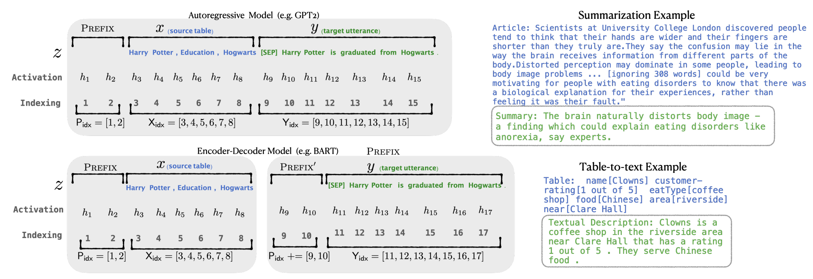

在模型内部, 每一层, 输入 token 之前构造一段任务相关的 virtual tokens 作为 Prefix, 然后训练的时候只更新 Prefix 部分的参数, 其他参数冻结.

* 对于自回归的LM模型(例如`GPT-2`)来说，会在原有prompt之前增加prefix(`z = [PREFIX; x; y]`);
* 对于encoder+decoder的LM模型(例如`BART`)来说，会分别在encoder和decoder的输入前加上prefix(`z = [PREFIX; x; PREFIX'; y],`)。

> 实际训练的时候, 如果直接训练prefix部分, 可能因为prefix的token维度太高了, 不好训练, 可以在 prefix 层前面多加一个MLP, 然后定义一个learnable 的低维输入向量, 还有一个learnable的MLP, 将低维输入向量变换为prefix. 最后**训练完成后只保留 Prefix 的参数**即可.

## Prompt Tuning - 18 Apr 2021 ENMLP


Prefix Tuning 的简化版本，只在输入层加入 prompt tokens，并不需要加入 MLP 进行调整来解决难训练的问题(只要预训练模型够强)

## P-Tuning v1 - 18 Mar 2021 ACL	

P-Tuning 方法的提出主要是为了解决这样一个问题：大模型的 Prompt 构造方式严重影响下游任务的效果。

P-Tuning 提出将 Prompt 转换为可以学习的 Embedding 层，因为直接对自然语言的prompt进行预测是很难的, 因为自然语言的token是离散的, 不可微的

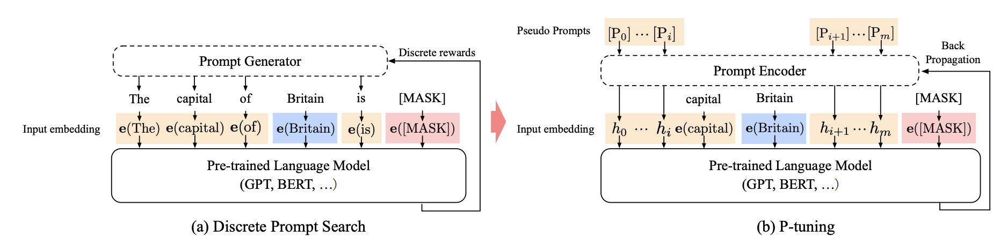

作者先针对prompt的离散性问题, 提出了trainable continuous prompt embeddings, 其实还是类似prompt tuning

这里提出用learnable的 MLP 和 learnable 的 LSTM 的作为prompt encoder方式来对 prompt embedding 进行一层处理, 因为发现收敛更快, 效果更好. 

* 只在输入的时候加入 Embedding, 利用多层感知机和 LSTM 对 Prompt 进行编码，编码之后与其他向量进行拼接之后正常输入 LLM。注意，训练之后只保留 Prompt 编码之后的向量即可，无需保留编码器

## P-Tuning v2 - 14 Oct 2021 ACL

P-Tuning 的问题是在小参数量模型上表现差


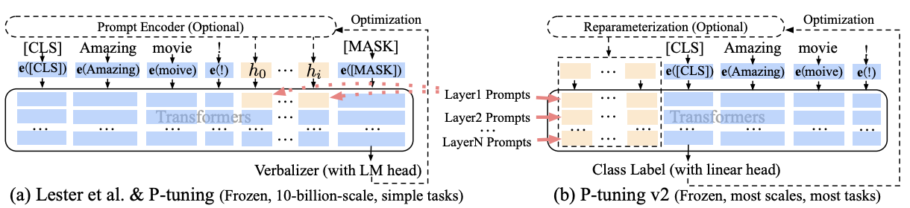

主要特点:

* 在输入前面的每层加入可微调的参数, 以抵消小模型对前缀向量的特征提取不足的局限
* 可以去掉重参数化的编码器. 

> 以前的方法利用重参数化功能来提高训练速度和鲁棒性（例如，用于prefix-tunning的 MLP 和用于 P-tuning的 LSTM）。在 P-tuning v2 中，作者发现重参数化的改进很小，尤其是对于较小的模型，同时还会影响模型的表现